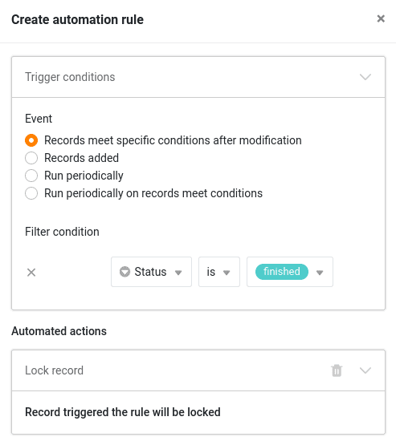



Um unerwünschte Änderungen an Zeilen zu verhindern, können Sie **Zeilen sperren**. Dies kann beispielsweise sinnvoll sein, wenn mehr als eine Person in einer Tabelle arbeitet. Die Sperrung kann entweder **manuell** durch Sie erfolgen oder **automatisch** durch eine [Automation]().

## So sperren Sie eine Zeile

1. Öffnen Sie eine beliebige Tabelle, in der Sie eine **Zeile** sperren möchten.
2. Klicken Sie mit der **rechten Maustaste** auf die Zeile, um das Drop-down-Menü zu öffnen.
3. Wählen Sie die Option **Zeile sperren** aus.

Sobald eine Zeile gesperrt ist, erscheint ein kleines **rotes Dreieck in der Nummerierungsspalte**.

## Zeilen entsperren

Genauso, wie Sie eine Zeile sperren, können Sie diese auch wieder **entsperren**. Folgen Sie dazu der oben beschriebenen Klickanleitung und wählen Sie die Option **Zeile entsperren** aus.



## Zeilen mithilfe einer Automation sperren

In SeaTable können Sie **Automatisierungsregeln** anlegen, um **Zeilen automatisch zu sperren**, sobald diese gewisse Bedingungen erfüllen.

Das ist sehr nützlich, wenn Sie viele Zeilen auf einmal sperren möchten oder immer ab einem bestimmten Zeitpunkt (z. B. wenn ein Vorgang abgeschlossen ist) verhindern wollen, dass eine Zeile weiter bearbeitet werden kann.

**Alles Weitere dazu erfahren Sie im Artikel** [Zeilen per Automation sperren]().


