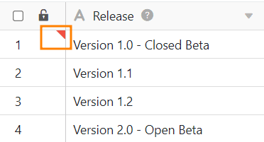



Para evitar cambios no deseados en las filas, puede **bloquearlas**. Esto puede ser útil, por ejemplo, si hay más de una persona trabajando en una mesa. El bloqueo puede ser **manual** o [automático]().

## Para bloquear una fila

1. Abra cualquier tabla en la que desee bloquear una **fila**.
2. **Haga clic con el botón derecho del ratón** en la línea para abrir el menú desplegable.
3. Seleccione la opción **Bloquear Fila**.

En cuanto se bloquea una fila, aparece un pequeño **triángulo rojo** en **la columna de numeración**.

## Desbloquear filas

Del mismo modo que bloqueas una fila, también puedes volver a **desbloquearla**. Para ello, siga las instrucciones de clic descritas anteriormente y seleccione la opción **Desbloquear fila**.



## Bloqueo de filas con ayuda de un automatismo



En SeaTable puede crear **reglas de automatización** para **bloquear automáticamente las filas** en cuanto cumplan determinadas condiciones.

Esto es muy útil si desea bloquear muchas filas a la vez o si siempre desea evitar que una fila se siga editando a partir de un momento determinado (por ejemplo, cuando finaliza un proceso).

**Encontrará más información al respecto en el artículo** [Bloqueo de filas mediante automatización]().


