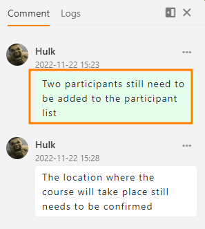

In SeaTable können Sie Zeilen kommentieren, um sich beispielsweise innerhalb eines Teams gegenseitig Rückmeldung zu geben oder Fragen zu stellen. Solche **Konversationen** sollten Sie nicht per E-Mail oder in Chatprogrammen führen, sondern am besten direkt da, wo die Daten sind, nämlich in der entsprechenden **Zeile** der Tabelle. So ist auch Wochen und Monate später ohne lange Suche klar, wie man sich verständigt hat und was der aktuelle Stand ist.

Wenn Sie gemeinsam mit anderen Nutzern in einer Tabelle arbeiten, können Sie in jeder einzelnen Zeile eine separate Diskussion führen. Zeilen, in denen eine Konversation läuft, sind durch ein **Sprechblasen-Icon** in der ersten Spalte gekennzeichnet. 

Probieren Sie es aus! Es gibt **zwei Möglichkeiten**, auf die Kommentarfunktion zuzugreifen.

## Zeilen kommentieren über das Drop-down-Menü

1. Klicken Sie mit der **rechten Maustaste** auf eine Zeile, um das **Drop-down-Menü** aufzurufen.
2. Wählen Sie die Option **Zeile kommentieren** aus.
3. Es öffnet sich eine **Kommentarspalte** am rechten Seitenrand.
4. Schreiben Sie Ihren Kommentar und bestätigen Sie mit **Abschicken**.

## Zeilen kommentieren über die Detailansicht

1. Bewegen Sie die Maus auf die **Nummerierung am Zeilenanfang**.
2. Öffnen Sie die **Zeilendetails**, indem Sie auf das **Doppelpfeil-Symbol** klicken.
3. Klicken Sie in dem erschienenen Fenster auf das **Tür-Symbol** oben rechts.
4. In der Kategorie **Kommentare** können Sie Kommentare schreiben.

## Teammitglieder in den Chat einfügen

Sie können Teammitglieder auf Ihren Kommentar aufmerksam machen, indem Sie sie über das **Plus-Symbol** zum Chat hinzufügen. Alternativ können Sie auch ein  und den **Namen** verwenden, um ein Teammitglied dem Chat hinzuzufügen. Das Mitglied bekommt eine [Benachrichtigung in SeaTable]() und wird ebenso über neue Kommentare im Chatverlauf benachrichtigt.

## Einem Kommentar Bilder hinzufügen

Über das **Bild-Icon** unter dem Eingabefeld können Sie Ihren Kommentaren auch **Bilder** hinzufügen. Diese sind nur in der Kommentarspalte sichtbar und werden zwar nicht in einer [Bild-Spalte]() der Tabelle, aber in der [Dateiverwaltung der Base]() gespeichert.

## Anzeige der kommentierten Zeilen

In der ersten Spalte der Tabelle erscheint bei kommentierten Zeilen ein **Sprechblasen-Icon** mit einer Zahl, welche die **Anzahl der Kommentare** in den letzten 180 Tagen angibt. Mit einem Klick auf das Icon öffnen Sie die Kommentarspalte mit dem Chatverlauf.

 



## Kommentare löschen und als erledigt markieren

Nur **Eigentümer** und **Administratoren** der Base sowie **der Ersteller des Kommentars selbst** können Kommentare **löschen**. Dazu klickt man auf die **drei Punkte** rechts neben einem Kommentar und wählt die Option  **Löschen** aus.

Zudem können alle Nutzer auf dem gleichen Weg Kommentare **als erledigt markieren**. Als erledigt markierte Kommentare werden durch eine grüne Farbe gekennzeichnet.

## Sichtbarkeit von Kommentaren

Kommentare sind für alle Personen mit Zugriff auf die Tabelle sichtbar. Das umfasst auch Personen, die über eine [Ansichtsfreigabe]() auf eine Tabelle zugreifen.

 

In der Base sind auch **alle Kommentare aus Apps**, die auf der Base aufbauen, sichtbar. In den Apps besteht wiederum Wahlfreiheit: Standardmäßig sehen Sie nur die in derselben App geposteten Kommentare. Sie können in den [App-Einstellungen]() allerdings aktivieren, dass alle Kommentare aus der Base auch in der App angezeigt werden.

## Kein Import, Export oder Kopieren von Kommentaren

Kommentare sind grundsätzlich weder kopierbar noch migrierbar und bleiben nur an der Stelle gespeichert, wo sie ursprünglich vorgenommen wurden. Das Verhalten ist wie folgt:

- Beim [Duplizieren von Zeilen]() werden keine Kommentare übernommen. Dies gilt auch für den **Füllgriff** sowie das **Kopieren und Einfügen** von Zeilen.
- Tabellen, die Sie [aus anderen Bases importieren](https://seatable.com/de/hilfe/eine-tabelle-in-einer-base-hinzufuegen/#tabelle-aus-einer-anderen-base-importieren) oder aus einem [gemeinsamen Datensatz]() erstellen, enthalten ebenfalls keine Kommentare.
- Kommentare werden auch nicht in [Snapshots]() oder [exportierten Dateien]() gespeichert.