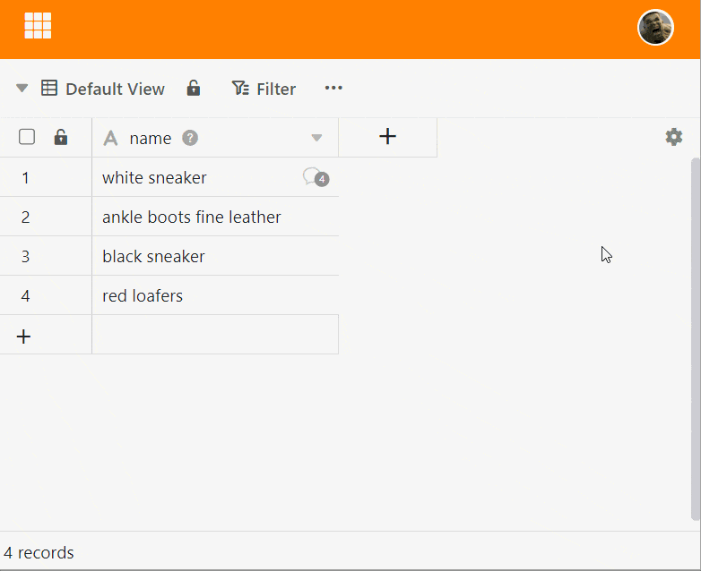
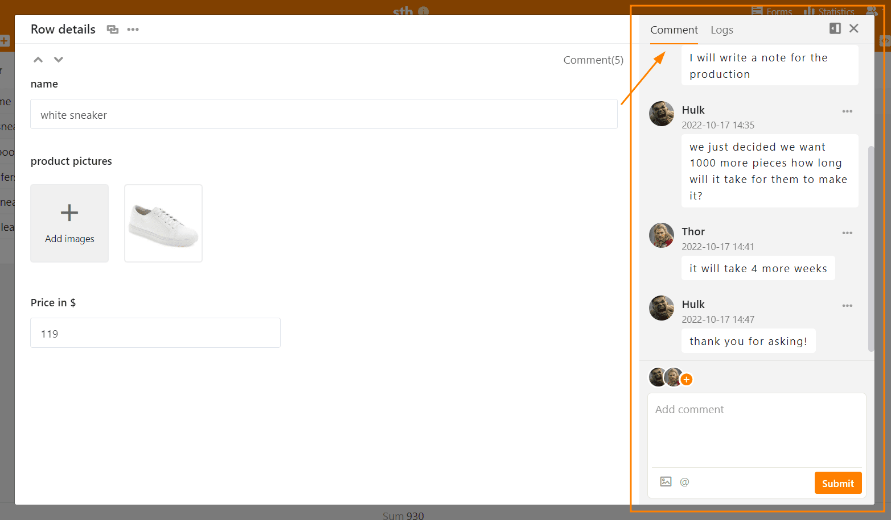
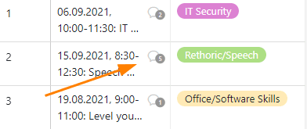
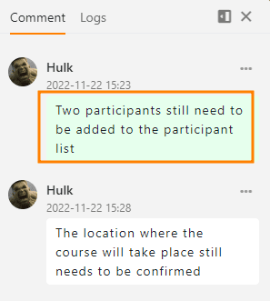

In SeaTable you can comment rows , for example to give feedback to each other within a team. There are **two ways to** access this feature.

## rows comment via the drop-down menu

1. **Right-click** on a row to access the **drop-down menu**.
2. Select the **Comment** option **row .**
3. A new window will open where you can write comments to a line entry.

## rows comment via the detail view

1. Move the mouse to the numbering at the beginning of the line.
2. Open the **line details** by clicking on the **double arrow icon**.
3. In the appeared window click the **door icon** in the upper right corner.
4. In the **comments** category you can write comments.

## Add team members to the chat

You can draw the attention of team members to your comment by sending it to them via the **Plus symbol** to add to the chat. Alternatively, you can also add a  and the **Member name** to add team members to the chat. The member gets a **Notification in SeaTable** and will be notified about new comments in the chat history, even if no further mention about  takes place.

## Display of the commented rows

In the first column of the table, a **speech bubble icon** appears for commented rows with a number indicating the **number of comments** in the last 180 days. Click on the icon to open the comment window with the chat history.



## Delete comments and mark as done

Only the **creator** himself can **delete** his comments or **mark them as done.** To do this, he clicks on the **three dots** to the right of his comment and selects the desired option. Comments marked as done are indicated by a green color.

## Add images to a comment

You can also add **images** to your comments via the **image icon** below the input field. These are only visible in the comment window and are not stored in an [image column of]() the table, but in the [file management of Base](https://seatable.io/en/docs/dateien-und-bilder/das-dateimanagement-einer-base/).
