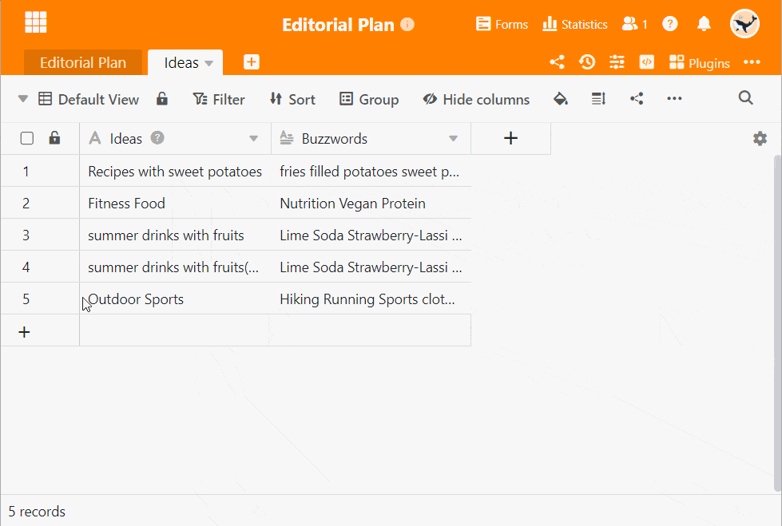

You can comment on rows in SeaTable, for example to give each other feedback or ask questions within a team. You should not conduct such **conversations** by e-mail or in chat programs, but preferably directly where the data is, namely in the corresponding **row** of the table. This way, even weeks and months later, it is clear how you communicated and what the current status is without having to search for a long time.

If you work together with other users in a table, you can have a separate discussion in each individual row. Rows in which a conversation is in progress are marked with a **speech bubble icon** in the first column.

Try it out! There are **two ways** to access the comment function.

## Comment on rows via the drop-down menu

1. **Right-click** on a row to access the **drop-down menu**.
2. Select **Comment row**.
3. A **comment column** will open on the right-hand side of the page.
4. Write your comment and confirm with **Submit**.

## Comment on rows via the row details

1. Move the mouse to the **number** at the beginning of a row.
2. Open the **row details** by clicking on the **double arrow icon**.
3. In the appeared window click the **door icon** in the upper right corner.
4. In the **comments** section you can write comments.

## Add team members to the chat

You can draw the attention of team members to your comment by adding them to the chat via the **Plus symbol**. Alternatively, you can also write a  and the **name** to add team members to the chat. The member gets a [notification in SeaTable]() and will be notified about new comments in the chat.

## Add images to a comment

You can also add **images** to your comments via the **image icon** below the input field. These are only visible in the comment column and are not stored in an [image column]() of the table, but in the [file management of the base]().

## Display of the commented rows

In the first column of the table, a **speech bubble icon** appears for commented rows with a number indicating the **number of comments** in the last 180 days. Click on the icon to open the comment column with the chat history.



## Delete comments and mark as resolved

Only **owners** and **administrators** of the base and **the creator of the comment** can **delete** comments. To do this, click on the **three dots** to the right of a comment and select the option  **Delete**.

In addition, all users can **mark comments as resolved** in the same way. Comments marked as resolved are marked with a green color.

## Visibility of comments

Comments are visible to all persons with access to the table. This also includes people who access a table via a [shared view]().



**All comments from apps** that are build on the base are also visible in the base. In the apps, there is freedom of choice: By default, you only see the comments posted in the same app. However, you can activate in the [App settings]() that all comments from the base are also displayed in the app.

## No import, export or copying of comments

Comments cannot be copied or migrated and are only saved where they were originally made. The behavior is as follows:

- When [duplicating lines](), no comments are copied. This also applies to the **fill handle** and the **copying and pasting** of rows.
- Tables that you [import from other bases](https://seatable.com/de/hilfe/eine-tabelle-in-einer-base-hinzufuegen/#tabelle-aus-einer-anderen-base-importieren) or create from a [common dataset]() also do not contain any comments.
- Comments are also not saved in [snapshots]() or [exported files]().