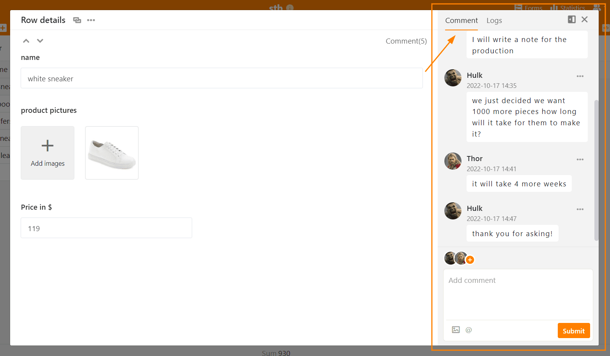

Puede comentar las filas en SeaTable, por ejemplo, para darse su opinión o plantear preguntas dentro de un equipo. No debe llevar a cabo estas **conversaciones** por correo electrónico o en programas de chat, sino preferiblemente directamente donde están los datos, es decir, en la **fila** correspondiente de la tabla. De este modo, incluso semanas y meses después, estará claro cómo se comunicaron y cuál es el estado actual sin tener que buscar durante mucho tiempo.

Si colabora con otros usuarios en una mesa, puede mantener una conversación separada en cada fila individual. Las filas en las que hay una conversación en curso se marcan con un **icono de burbuja** en la primera columna.

¡Pruébelo! Hay **dos maneras** de acceder a la función de comentarios.

## Comentar las filas a través del menú desplegable

1. Haga clic con **el botón derecho del ratón** en una fila para abrir el **menú desplegable**.
2. Seleccione la opción **Comentar fila**.
3. Se abrirá una **columna de comentarios** en la parte derecha de la página.
4. Escriba su comentario y confirme con **Enviar**.

## Comentar las filas a través de la vista detallada

1. Mueva el ratón hasta la **numeración** del principio de la fila.
2. Abra **los detalles de la fila** haciendo clic en el **icono de la doble flecha**.
3. En la ventana que aparece, haga clic en el **símbolo de la puerta**, arriba a la derecha.
4. En la categoría de **comentarios** puede escribir comentarios.

## Añadir miembros del equipo al chat

Puede llamar la atención de los miembros del equipo sobre su comentario añadiéndolos al chat mediante el símbolo **Plus**. También puede añadir un  y el **Nombre del miembro** para añadir miembros del equipo al chat. El miembro recibe un [notificación en SeaTable]() y será notificado de nuevos comentarios en el historial del chat.

## Añadir imágenes a un comentario

También puede añadir **imágenes** a sus comentarios mediante el **icono de imagen** situado debajo del campo de entrada. Éstas sólo son visibles en la ventana de comentarios y no se guardan en una [columna de imágenes]() de la tabla, sino en la [gestión de archivos de la base]().

## Visualización de las filas comentadas

En la primera columna de la tabla aparece, para las filas comentadas, un **icono en forma de burbuja de diálogo** con un número que indica el **número de comentarios** en los últimos 180 días. Haga clic en el icono para abrir la columna de comentarios con el historial del chat.



## Borrar comentarios y marcar como resuelto

Sólo los **propietarios** y **administradores** de la base y **el creador del comentario** pueden **borrar** comentarios. Para ello, haga clic en los **tres puntos** a la derecha de un comentario y seleccione la opción  **Borrar**.

Todos los usuarios pueden también **marcar comentarios como resueltos** del mismo modo. Los comentarios marcados como resueltos se indican con un color verde.

## Visibilidad de los comentarios

Los comentarios son visibles para todas las personas con acceso a la tabla. Esto incluye también a las personas que acceden a una tabla a través de una [vista compartida]().



**Todos los comentarios de las apps** que se basan en la base también son visibles en la base. En las apps, tiene libertad de elección: por defecto, sólo se ven los comentarios publicados en la misma app. Sin embargo, puede activar en los [ajustes de la app]() que todos los comentarios de la base se muestren también en la app.

## No importar, exportar o copiar comentarios

Los comentarios no se pueden copiar ni migrar y sólo se guardan donde se hicieron originalmente. El comportamiento es el siguiente:

- Al [duplicar filas](), no se copia ningún comentario. Esto también se aplica a la **manipulación de relleno** y al **copiado y pegado** de filas.
- Las tablas que [importa de otras bases](https://seatable.com/de/hilfe/eine-tabelle-in-einer-base-hinzufuegen/#tabelle-aus-einer-anderen-base-importieren) o cree a partir de un [conjunto de datos compartido]() tampoco contienen comentarios.
- Los comentarios tampoco se guardan en [instantáneas]() o [archivos exportados]().