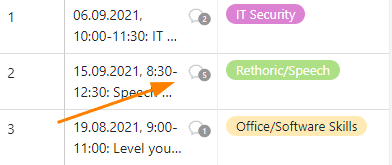

En SeaTable puede comentar las filas, por ejemplo para darse retroalimentación dentro de un equipo. Hay **dos formas de** acceder a esta función.

## Comentar líneas mediante el menú desplegable

1. **Haga clic con el botón derecho del ratón** en una línea para abrir el **menú desplegable**.
2. Seleccione la opción de **la línea de comentarios**.
3. Se abre una nueva ventana en la que puede escribir comentarios sobre una entrada de línea.

## Comentar las líneas a través de la vista detallada

1. Mueva el ratón hasta la numeración del principio de la línea.
2. Abra **los detalles de la fila** haciendo clic en el **icono de la doble flecha**.
3. En la ventana que aparece, haz clic en el **símbolo de la puerta**, arriba a la derecha.
4. En la categoría de **comentarios** puede escribir observaciones.

## Añadir miembros del equipo al chat

Puede llamar la atención de los miembros del equipo sobre su comentario poniéndose en contacto con ellos a través de la página **Símbolo Plus** para añadirlo al chat. También puede añadir un  y el **Nombre del miembro** para añadir miembros del equipo al chat. El miembro recibe un **Notificación en SeaTable** y será notificado de nuevos comentarios en el historial del chat, incluso si no se hace ninguna otra mención sobre  tiene lugar.

## Visualización de las líneas comentadas

En la primera columna de la tabla aparece, para las líneas comentadas, un **icono en forma de bocadillo** con un número que indica el **número de comentarios** en los últimos 180 días. Haz clic en el icono para abrir la ventana de comentarios con el historial del chat.



## Eliminar comentarios y marcar como hecho

Sólo el propio **creador** puede **borrar** sus comentarios o **marcarlos como hechos.** Para ello, haga clic en los **tres puntos** a la derecha del comentario y seleccione la opción deseada. Los comentarios marcados como hechos se indican con un color verde.

## Añadir imágenes a un comentario

También puede añadir **imágenes** a sus comentarios mediante el **icono de imagen** situado debajo del campo de entrada. Éstas sólo son visibles en la ventana de comentarios y no se guardan en una [columna de](https://seatable.io/es/docs/dateien-und-bilder/die-bild-spalte/) imágenes de la tabla, sino en la [gestión de archivos de la base](https://seatable.io/es/docs/dateien-und-bilder/das-dateimanagement-einer-base/).
