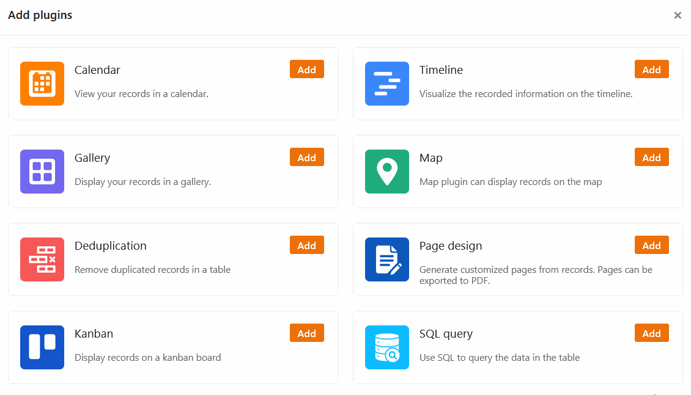

Selon la tâche et les données saisies, différents **modes d'affichage** sont utiles pour vous faciliter le travail dans SeaTable. SeaTable vous propose deux types d'affichage : Les données quantitatives sont plus faciles à saisir dans la vue Tableau, à structurer à l'aide de filtres, de tris et de regroupements, et à analyser à l'aide de **statistiques**.

Pour les types de données avancés que vous pouvez stocker et organiser dans SeaTable, il existe des vues avancées sous forme de **plugins**. Pour la planification du temps, par exemple, la ligne du temps et le calendrier s'avèrent particulièrement utiles. La galerie est idéale pour les images et la carte pour les données géographiques. Un tableau Kanban est surtout utile pour les regroupements de sélections simples.

Découvrez dans cet article quelles sont les vues et les plug-ins disponibles, comment les utiliser et pour quels cas d'utilisation ils sont particulièrement adaptés.

## Vue du tableau

SeaTable dispose d'un **affichage sous forme de tableau** pour les cas d'utilisation les plus courants. Ici, vos données sont saisies dans un tableau composé de **lignes** et de **colonnes**. La vue Tableau est la **vue par défaut** de SeaTable : lorsque vous ouvrez une base, vous voyez d'abord vos données sous forme de tableau.

La vue Tableaux est essentielle pour la saisie, l'édition et la gestion manuelles des données dans une base : C'est dans cette vue que vous créez les tableaux et définissez la structure des colonnes. Pour ce faire, chaque colonne se voit attribuer un [type]() qui permet de saisir certaines données.

L'affichage sous forme de tableau est particulièrement adapté à la présentation de données textuelles et chiffrées. Les paramètres d'affichage disponibles, tels que [le regroupement, le tri et les filtres](), vous permettent également d'effectuer très rapidement des évaluations simples.

Dans la [ligne d'état](), vous avez à tout moment un aperçu du nombre de lignes et des valeurs des colonnes.

### Statistiques

Pour créer des graphiques et visualiser des chiffres, utilisez le module Statistiques de SeaTable. Il permet de réaliser des analyses plus complexes que dans les tableaux. De plus, il offre de nombreuses possibilités de représentation graphique grâce aux nombreux types de graphiques pris en charge.

Vous trouverez des informations complètes sur les possibilités d'évaluation statistique dans le [guide du module statistique]().

## Vues avancées

Des **plug-ins** permettent d'ajouter des options de représentation à l'affichage des tableaux. Ils permettent d'élargir le champ d'application de SeaTable au-delà de l'analyse purement quantitative de données numériques, ce qui rend possible des cas d'utilisation qu'un tableur classique ne peut pas couvrir.

Les plugins vous permettent de visualiser vos données sous différents angles. Le jeu de données reste toujours exactement le même, seule la présentation change.

Vous activez les plugins via le gestionnaire de plugins, que vous ouvrez en cliquant sur le bouton **Plugins** en haut à droite dans l'en-tête de la base. Pour savoir comment ajouter des plugins à votre base, [cliquez ici](). Les plugins sont toujours activés uniquement pour la base ouverte. Le cas échéant, vous devez répéter l'activation des plugins dans d'autres bases.

Avec le [plug-in](), vous gérez rapidement et facilement les images dans votre base.

Affichez les adresses et les données de position sur une carte grâce au [plug-in de carte]() vous aide à transformer rapidement vos ensembles de données en documents mis en page.
