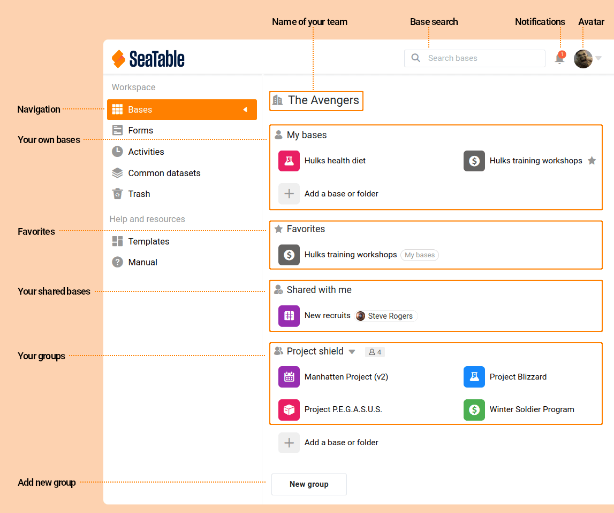

Для новичков терминология SeaTable не так проста: что такое **база**? В чем разница между **командой** и **группой**? Что такое представление и где находятся **опции представления**? В этом глоссарии мы объясняем термины и понятия, являющиеся центральными в SeaTable, и связываем их друг с другом. Для удобства это делается на примере различных элементов пользовательского интерфейса SeaTable.

## Домашняя страница

| Срок                                             | Объяснение или описание                                                                                                                                                                                                                                                                                                                                                                                                                                                                                          |
| ------------------------------------------------ | ---------------------------------------------------------------------------------------------------------------------------------------------------------------------------------------------------------------------------------------------------------------------------------------------------------------------------------------------------------------------------------------------------------------------------------------------------------------------------------------------------------------- |
| Главная страница Домашняя страница 🇬🇧            | Стартовая страница появляется после входа в систему SeaTable. Она состоит из двух основных элементов: Навигация (слева) и обзор баз (справа).                                                                                                                                                                                                                                                                                                                                                                    |
| Команда 🇬🇧 команда _(только для SeaTable Cloud)_ | Команда состоит из всех пользователей подписки на SeaTable Cloud. Член команды может напрямую поделиться базой с другим членом команды. Члены команды также могут объединяться в группы. Управление командой осуществляется в администрации команды одним или несколькими администраторами команды. Доступ к администрированию команды можно получить, щелкнув на аватаре. Администратор команды также может вносить изменения в подписку SeaTable Cloud.                                                        |
| Группа Группа 🇬🇧                                 | Группа состоит из одного или нескольких членов команды. Таким образом, группа - это средство тематической организации пользователей в команде, позволяющее им легко работать вместе. Каждая группа однозначно идентифицируется в команде по ее названию. Каждому члену группы назначается роль, которая определяет права пользователя в группе. Независимо от роли, каждый член группы имеет доступ ко всем базам группы.                                                                                        |
| База 🇬🇧 база                                     | База - это база данных. База состоит из одной или нескольких таблиц и может содержать многие тысячи строк. Все базы, к которым пользователь имеет доступ, отображаются на стартовой странице. С точки зрения пользователя, существует три типа баз: "Мои" базы были созданы пользователем и принадлежат ему. Общие базы принадлежат другому пользователю, но были предоставлены вам, чтобы вы могли получить доступ к данным. Групповые базы - это базы, которые были созданы в группе и поэтому принадлежат ей. |
| Избранное 🇬🇧 Избранное                           | Избранное - это часто используемые пользователем базы. Они отображаются в отдельной области на стартовой странице. Пользователь может добавлять базы в избранное и удалять их из избранного.                                                                                                                                                                                                                                                                                                                     |
| шаблон шаблон 🇬🇧                                 | Шаблон - это база с готовыми таблицами и структурами данных для конкретного случая использования. Таким образом, шаблон обеспечивает быстрый путь к разработке приложения в SeaTable.                                                                                                                                                                                                                                                                                                                            |
| Уведомление 🇬🇧 уведомление                       | Уведомление - это сообщение в системе SeaTable. Уведомление может быть создано системой (например, когда пользователь делится базой с другим пользователем) или активно отправлено пользователем (например, через действие кнопки или комментарий в строке). О наличии новых уведомлений свидетельствует цифра на пиктограмме колокольчика.                                                                                                                                                                      |
| Аватар 🇬🇧 аватар                                 | Аватар - это изображение, связанное с пользователем в SeaTable. Аватар используется во многих местах SeaTable для представления пользователя (например, в журналах). Пользователи могут самостоятельно выбирать и изменять свой аватар.                                                                                                                                                                                                                                                                          |

## База

| Срок                                     | Объяснение или описание                                                                                                                                                                                                                                                                                                                                                                                                                                                                                                                                                                                                  |
| ---------------------------------------- | ------------------------------------------------------------------------------------------------------------------------------------------------------------------------------------------------------------------------------------------------------------------------------------------------------------------------------------------------------------------------------------------------------------------------------------------------------------------------------------------------------------------------------------------------------------------------------------------------------------------------ |
| Таблица 🇬🇧 стол                          | Таблицы являются составными элементами баз. Таблица состоит из столбцов, строк и представлений. Каждая таблица отображается в базе в виде вкладки. Существует принципиальное отличие таблиц в SeaTable от электронных таблиц (например, Excel): в SeaTable между наборами данных можно создавать связи. Это делает базу данных в SeaTable реляционной базой данных. В электронных таблицах можно только ссылаться на другие ячейки.                                                                                                                                                                                      |
| Посмотреть 🇬🇧 просмотр                   | Представление - это определенное пользователем представление данных в таблице. Представление определяется используемыми настройками сортировки, фильтрации, группировки, скрытия столбцов и другими параметрами представления. Таблица может содержать одно или несколько представлений. Все представления таблицы имеют доступ к одному и тому же набору данных. Это означает: если в представлении изменяется значение ячейки, то оно изменяется и в нижележащей таблице, а значит, и во всех представлениях этой таблицы. Если представление заблокировано, то настройки представления больше не могут быть изменены. |
| Заголовок таблицы 🇬🇧 Заголовок таблицы   | Заголовок таблицы содержит все заголовки столбцов таблицы, а также их метаинформацию (например, тип столбца, описание столбца, ширина столбца). Если заголовок таблицы заблокирован, то все элементы заголовка таблицы больше не могут быть изменены.                                                                                                                                                                                                                                                                                                                                                                    |
| Колонка 🇬🇧 колонка                       | В столбце хранятся данные одного типа. SeaTable предлагает [25 различных типов колонок]() для хранения самой разнообразной информации: текста, дат, чисел, изображений, файлов, флажков или формул. Первый столбец в каждой таблице не может быть удален, перемещен или скрыт. Кроме того, в первом столбце доступны только 6 типов столбцов.                                                                                                                                                                                                      |
| Ряд 🇬🇧 ряд                               | Одна линия представляет собой один набор данных.                                                                                                                                                                                                                                                                                                                                                                                                                                                                                                                                                                         |
| Плагины 🇬🇧 Плагины                       | Плагины - это расширения для SeaTable. Существуют различные типы плагинов. Плагины для визуализации данных - это галерея, календарь, карта, канбан и временная шкала. Плагин дизайна страниц - это плагин, позволяющий оформлять документы. Плагины SQL-запросов и дедупликации данных позволяют осуществлять поиск и удаление записей. Плагины могут [разрабатываться](https://developer.seatable.com/plugins/) и [индивидуально](https://developer.seatable.com/plugins/).                                                                                                                                             |
| Детали ряда 🇬🇧 Детали ряда               | В строке Подробности отображаются все (не скрытые) колонки записи на странице. Столбцы, доступные только для чтения, выделены серым фоном; все остальные столбцы можно редактировать. В строке также отображаются комментарии и история редактирования записи (если она доступна).                                                                                                                                                                                                                                                                                                                                       |
| Описание базы 🇬🇧 описание базы           | Каждая база имеет описание базы, которое открывается автоматически при первом открытии базы пользователем. Описание предназначено для предоставления пользователям инструкций по использованию или дополнительной информации о базе.                                                                                                                                                                                                                                                                                                                                                                                     |
| Варианты просмотра 🇬🇧 варианты просмотра | Опции представления включают в себя все настройки и функции, с помощью которых можно создавать, изменять и управлять представлениями.                                                                                                                                                                                                                                                                                                                                                                                                                                                                                    |
| Формы 🇬🇧 формы                           | Форма - это веб-страница, которая может использоваться для создания новых записей. По умолчанию формы SeaTable являются общедоступными, но доступ к ним может быть ограничен.                                                                                                                                                                                                                                                                                                                                                                                                                                            |
| Приложение 🇬🇧 приложение                 | Приложение SeaTable App - это веб-приложение с собственным именем и URL, основанное на базе Base. Поскольку база поддерживает несколько приложений, приложения могут быть использованы для разработки специальных веб-приложений, оптимизированных для соответствующей целевой группы пользователей.                                                                                                                                                                                                                                                                                                                     |
| Статистика 🇬🇧 статистика                 | Статистика - это количественная оценка содержимого таблицы. SeaTable предоставляет в качестве статистики различные (простые и комбинированные) типы диаграмм и поворотных таблиц.                                                                                                                                                                                                                                                                                                                                                                                                                                        |
| Автоматизация 🇬🇧 автоматизация           | Автоматизация - это последовательность определенных действий, которые выполняются при наступлении определенного события и/или выполнении определенного условия. Автоматизация позволяет надежно выполнять повторяющиеся задачи, тем самым минимизируя время и ошибки.                                                                                                                                                                                                                                                                                                                                                    |
| Скрипт 🇬🇧 скрипт                         | Скрипты - это небольшие программы для автоматизации повторяющихся или сложных процедур обработки данных. SeaTable может обрабатывать скрипты на языках [JavaScript](https://developer.seatable.com/scripts/python/basic_structure_python/) и [Python](https://developer.seatable.com/scripts/python/basic_structure_python/). Сценарии могут запускаться как вручную с помощью кнопки, так и с помощью автоматики.                                                                                                                                                                                                       |
| Поделиться 🇬🇧 поделиться                 | Доля - это разрешение, предоставляемое одним пользователем другому пользователю на доступ к ресурсу. В SeaTable доли могут быть предоставлены для всей базы, части базы или отдельного представления. Уровень прав доступа к ресурсу определяет, какой доступ к данным имеет пользователь (только чтение или также редактирование).                                                                                                                                                                                                                                                                                      |
