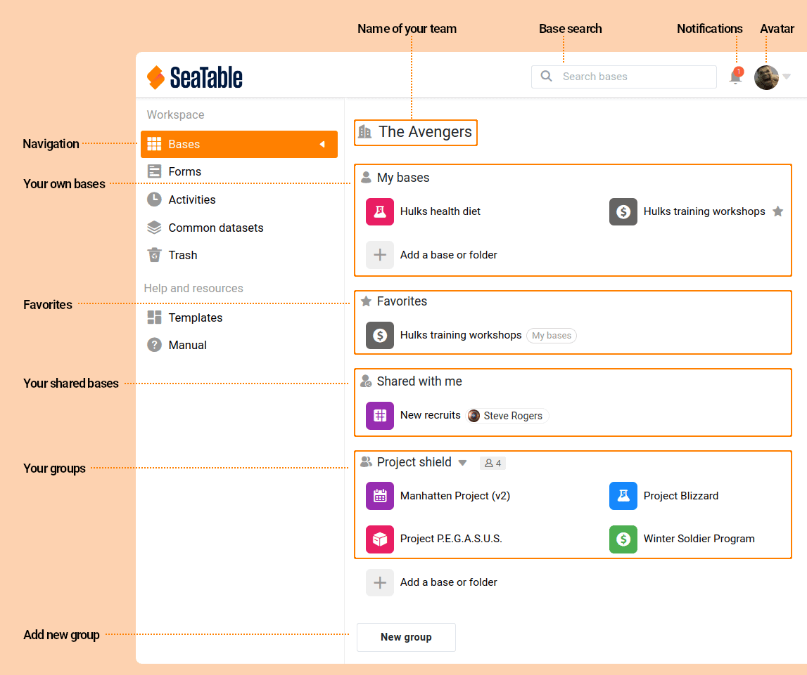
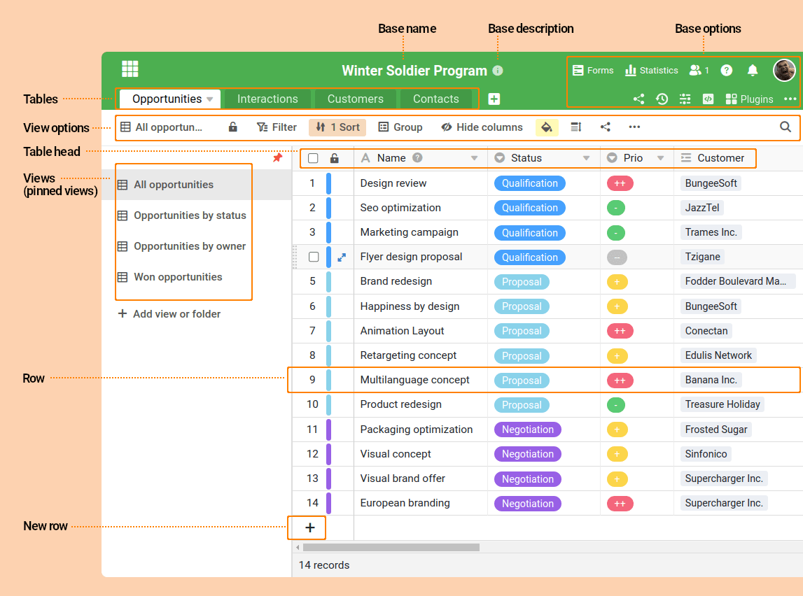

Für Einsteiger ist SeaTables Terminologie nicht ganz einfach: Was ist eine **Base**? Was ist der Unterschied zwischen einem **Team** und einer **Gruppe**? Was hat es mit einer Ansicht auf sich und wo befinden sich die **Ansichtsoptionen**? In diesem Glossar erläutern wir die für SeaTable zentralen Begriffe und Konzepte und setzen sie miteinander in Beziehung. Für eine einfache Nachvollziehbarkeit erfolgt dies anhand der unterschiedlichen Elemente der SeaTable Benutzeroberfläche.

## Startseite

 

\[table id=46 /\]

## Base

 

\[table id=49 /\]
