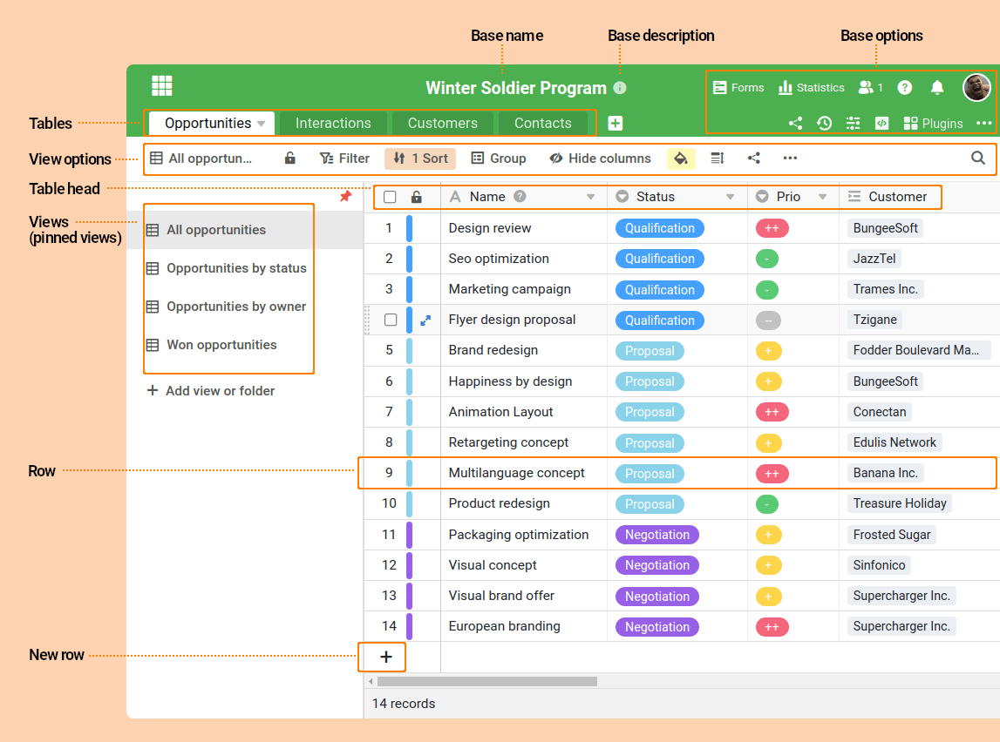

Commençons par vous montrer comment utiliser SeaTable. SeaTable est une solution web que vous pouvez utiliser confortablement avec votre navigateur. Nous allons brièvement passer en revue les différents éléments de l'interface et nous vous montrerons à quoi correspondent les différentes icônes et où vous trouverez les éléments dont vous avez besoin pour créer vos bases.

Ouvrez donc votre navigateur, accédez à la page de connexion de SeaTable et connectez-vous avec vos données d'accès. La page d'accueil devrait ressembler à peu près à ceci :

## La page d'accueil

La page d'accueil se divise en deux parties : La navigation (à gauche) et l'aperçu des bases (à droite). Il est probable que vous ne voyiez encore que peu ou pas de bases. Mais cela va bientôt changer. Une base est toujours représentée par une tuile colorée et votre nom, qui se trouve à droite.

### Qu'est-ce qu'une base exactement ?

Une base est une banque de données. Une base se compose d'une ou plusieurs tables et peut contenir plusieurs milliers de lignes. Toutes les bases auxquelles un utilisateur a accès sont affichées sur la page d'accueil. SeaTable distingue différents espaces de travail en fonction de la personne qui a créé la base ou qui y a accès. Les mots-clés correspondants sont ici :

- **Mes bases**: vous avez créé vous-même des bases dans cette zone et tant que vous n'avez pas explicitement partagé la base avec quelqu'un ou un groupe, vous êtes le seul à y avoir accès.
- **Les favoris**: Vous pouvez marquer n'importe quelle base comme favorite afin de toujours la retrouver dans cette section.
- **Groupes**: SeaTable vit de la collaboration. Grâce aux groupes, vous pouvez rendre une base accessible à un groupe de personnes.

## L'éditeur de base

Ouvrez maintenant une de vos bases en cliquant avec la souris sur une de vos bases. Si vous n'avez pas encore de base, il vous suffit d'en créer une. Le nom de votre base n'a pas d'importance pour le moment.

Dans un premier temps, vous ne verrez que trois cellules vides dans votre base, ne vous laissez donc pas désorienter lorsque nous expliquerons les différents éléments à l'aide d'une base d'exemple remplie.

Ouf, la première vue d'une base peut être assez effrayante. Il y a tant de boutons et de possibilités d'interaction qui attendent d'être utilisés. Voyons les différents éléments en détail.

### Tableaux

Dans l'en-tête de chaque base, les tableaux de votre base se trouvent côte à côte sous forme d'onglets. Les tableaux dans SeaTable sont comparables aux feuilles de calcul dans Excel ou aux tableaux d'une base de données. Selon que vous connaissez déjà l'un ou l'autre. Dans chaque tableau, vous pouvez créer des colonnes afin de saisir et de sauvegarder les informations souhaitées. Alors que dans Excel, toutes les colonnes sont identiques, dans SeaTable, vous devez à chaque fois sélectionner un type de colonne lors de la création. Vous définissez ainsi le type d'informations que vous souhaitez enregistrer dans cette colonne. Cela semble compliqué, mais ça ne l'est pas :

- Dans une colonne de chiffres, vous pouvez uniquement enregistrer des chiffres, mais pas d'images.
- Dans une colonne de date, vous pouvez uniquement enregistrer des valeurs de date, mais pas de chiffres.
- Dans un ... - je pense que vous avez compris le principe.

### Lignes

Vous enregistrez vos informations dans les lignes d'un tableau. Chaque ligne représente un enregistrement. Par exemple, si vous avez créé un tableau `Expenses` avec 50 lignes, alors vous avez saisi une sortie dans chacune des 50 lignes.

### Vues

Une vue est une représentation définie par l'utilisateur des lignes d'un tableau. Chaque vue est définie par les tris, les filtres, les regroupements, les masquages de colonnes utilisés ainsi que par d'autres paramètres de la vue.

Un tableau peut contenir une ou plusieurs vues. Toutes les vues d'un tableau accèdent à la même base de données. Cela signifie que si une valeur de cellule est modifiée dans une vue, la valeur est modifiée dans le tableau sous-jacent et donc également dans toutes les vues du tableau.

Dans ce cours en ligne, nous allons examiner de plus près le concept des vues et l'illustrer par des cas d'application concrets.

## Résumé

Dans cette leçon, vous avez découvert différents éléments de l'interface SeaTable. Ne vous laissez pas intimider par les nombreuses possibilités de l'interface utilisateur. Dans la prochaine partie de ce cours en ligne, nous commencerons à construire votre propre **système de gestion des dépenses**, ce qui vous permettra d'utiliser et de découvrir de nombreuses fonctionnalités de SeaTable.

Si vous souhaitez vous familiariser avec l'interface utilisateur et la terminologie de SeaTable, nous vous recommandons de consulter notre [glossaire](https://seatable.io/fr/docs/erste-schritte/glossar-der-von-seatable-verwendeten-begriffe/). Vous y trouverez des explications détaillées sur l'interface utilisateur et les termes utilisés dans SeaTable.

## Article d'aide avec plus d'informations

Dans les articles suivants, nous insérerons toujours en fin de page un paragraphe renvoyant à notre rubrique d'aide. Ainsi, nous vous guiderons certes dans le cadre de ce cours en ligne, mais nous ne visualiserons pas chaque clic de souris par une capture d'écran. Si vous ne savez pas comment faire, les articles d'aide devraient vous aider.

- [Créer une nouvelle base](https://seatable.io/fr/docs/arbeiten-mit-bases/eine-neue-base-erstellen/)
- [Qu'est-ce qu'une vue ?]()
- [Glossaire SeaTable](https://seatable.io/fr/docs/erste-schritte/glossar-der-von-seatable-verwendeten-begriffe/)
- [Ajouter une base aux favoris](https://seatable.io/fr/docs/arbeiten-mit-bases/eine-base-zu-den-favoriten-hinzufuegen/)
