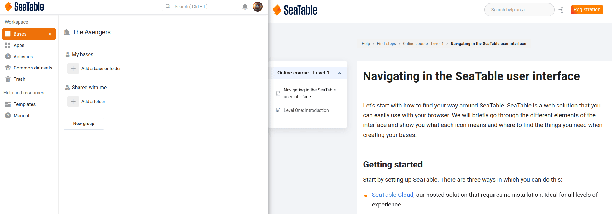
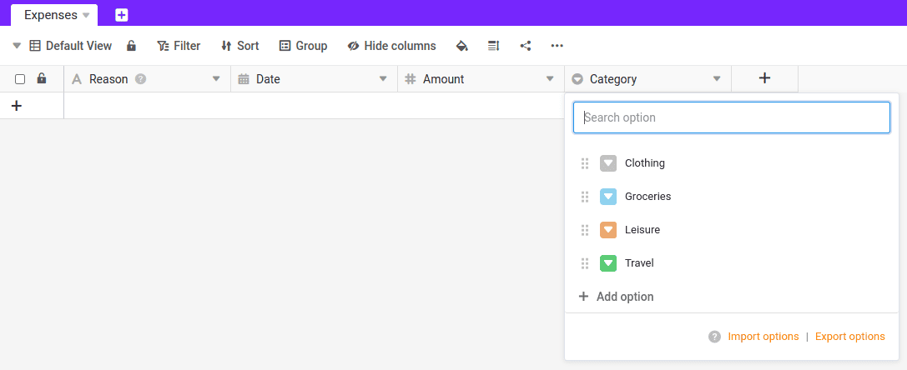

In diesem Kurs wollen wir ein einfaches Tool zur Erfassung und Verwaltung Ihrer persönlichen oder beruflichen Ausgaben erstellen. Wenn Sie fertig sind, können Sie zu jeder Zeit entweder über Ihren Computer oder auch mit Ihrem Mobiltelefon Ausgaben erfassen. Jedes Mal, wenn Sie Ihren Geldbeutel zücken, sollten Sie anschließend diese Ausgabe dokumentieren. Der Lohn für diese Mühe ist, dass Sie auf einen Blick sehen können, wofür Sie wie viel Geld ausgegeben haben.

Beginnen wir diesen Online Kurs also damit, dass wir die notwendige Struktur anlegen, um diese Ausgaben speichern zu können. Hierfür werden Sie eine erste Base und anschließend einige Spalten anlegen. Sie werden sehen, dass die folgenden Schritte fast schon selbsterklärend sind.



## Neue Base anlegen

Wir beginnen auf der Startseite von SeaTable. Legen Sie eine neue Base mit dem Namen `Expense Tracking` an. Klicken Sie anschließend auf diese Base, um zum Base Editor zu gelangen.

## Ändern Sie den Namen der ersten Tabelle

Jede Base beinhaltet standardmäßig eine Tabelle mit dem Namen `Table 1`, die eine Spalte mit drei Zeilen besitzt.

- Löschen Sie die drei Zeilen
- Ändern Sie anschließend den Namen der Tabelle auf `Expenses`

{{< warning  type="warning" headline="Hilfe, wenn Sie nicht weiterkommen"  text="Die Bedienung von SeaTable sollte in den meisten Fällen intuitiv sein. Zum Beispiel können Sie Zeilen auf die gleiche Weise löschen, wie Sie es von vielen anderen Softwarelösungen gewohnt sind: Markieren Sie die Zeilen und machen Sie einen Rechtsklick. Sollten Sie dennoch Unterstützung benötigen, denken Sie an die Hilfeartikel, die wir am Ende der Seite für Sie zusammengestellt haben. Dort finden Sie zu jedem Schritt dieses Online-Kurses die passenden Anleitungen." />}}

## Passen Sie die Spalten der Tabelle an und fügen Sie neue hinzu

Als Nächsten wenden wir uns den Spalten der Tabelle zu, damit unsere Base die gewünschten Daten aufnehmen kann.

- Ändern Sie den Namen der ersten Spalte von `Name` auf `Reason`
- Fügen Sie nun drei weitere Spalten hinzu

**Spalte 1:**

> Name: `Date`
>
> Spaltentyp: ` Date`
>
> Format: beliebig
>
> Minutengenau: `Yes`

**Hinweis:** Anstelle des Spaltentyps ` Date` hätte man hier auch den Spaltentyp ` Created time` verwenden können. Während Sie die Datumsspalte händisch ausfüllen müssen, würde diese automatisch mit dem aktuellen Datum gefüllt werden. Das spart natürlich Zeit. Der Nachteil wäre aber, dass Sie den Datumswert nicht mehr verändern können und z.B. rückwirkend keine Ausgaben mehr für andere Tage erfassen könnten.

---

**Spalte 2:**

> Name: `Amount`
>
> Spaltentyp: ` Number`
>
> Format: `Euro`

---

**Spalte 3:**

> Name: `Category`
>
> Spaltentyp: ` Single select`

---



## Einfachauswahl Optionen hinzufügen

Aktuell hat Ihre Einfachauswahl noch keine Auswahlmöglichkeiten. Legen Sie deshalb als Nächstes, für die Spalte `Category` die folgenden vier Optionen fest:

- Clothing
- Groceries
- Leisure
- Travel

## Kurzer Qualitätscheck

Fantastisch. Wenn Sie der Anleitung genau gefolgt sind, sollte ihre Base nun so aussehen:

Rekapitulieren wir kurz, was Sie gerade mit wenigen Mausklicks erschaffen haben: **Sie haben nun eine Base, in der Sie zukünftig alle Ihre Ausgaben erfassen können.**

Gleichzeitig haben Sie durch die Wahl der Spaltentypen sichergestellt, dass in den Spalten nur die passenden Informationen erfasst werden können.

Das war auch schon Schritt 1 dieses Online Kurses. Scrollen Sie bis ans Ende dieses Artikels und springen Sie zu **Schritt 2: Erstellen eines Formulars**.

## Hilfeartikel mit weiteren Informationen

- [Eine neue Base erstellen]()
- [Wie man den Spaltentyp anpasst]()
- [Löschen einer Zeile]()
- [Hinzufügen einer Spalte]()
- [Hinzufügen von Optionen zu einer Einfachauswahl-Spalte]()
- [Besonderheiten der ersten Spalte]()
- [Aussehen einer Base anpassen (Icon und Farbe)]()
