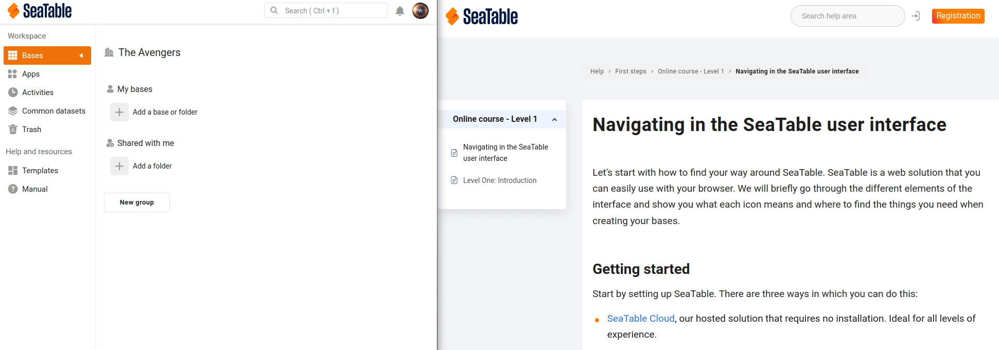

Dans ce cours, nous allons créer un outil simple pour enregistrer et gérer vos dépenses personnelles ou professionnelles. Lorsque vous aurez terminé, vous pourrez enregistrer vos dépenses à tout moment, soit sur votre ordinateur, soit sur votre téléphone portable. Chaque fois que vous sortez votre porte-monnaie, vous devez ensuite documenter cette dépense. La récompense de ces efforts est que vous pouvez voir d'un coup d'œil où et combien vous avez dépensé.

Commençons donc ce cours en ligne par créer la structure nécessaire pour pouvoir enregistrer ces sorties. Pour cela, vous allez créer une première base, puis quelques colonnes. Vous verrez que les étapes suivantes sont presque évidentes.



## Créer une nouvelle base

Commençons par la page d'accueil de SeaTable. Créez une nouvelle base avec le nom `Expense Tracking` sur la base. Cliquez ensuite sur cette base pour accéder à l'éditeur de base.

## Modifier le nom du premier tableau

Par défaut, chaque base contient une table nommée `Table 1`qui possède une colonne de trois lignes.

- Supprimez les trois lignes
- Modifiez ensuite le nom du tableau en `Expenses`

{{< warning  headline="De l'aide si vous êtes bloqué"  text="L'utilisation de SeaTable devrait être intuitive dans la plupart des cas. Par exemple, vous pouvez supprimer des lignes de la même manière que vous avez l'habitude de le faire avec de nombreuses autres solutions logicielles : Sélectionnez les lignes et faites un clic droit. Si vous avez toutefois besoin d'aide, pensez aux articles d'aide que nous avons rassemblés pour vous en bas de page. Vous y trouverez des instructions adaptées à chaque étape de ce cours en ligne." />}}

## Personnalisez les colonnes du tableau et ajoutez-en de nouvelles

Ensuite, nous nous penchons sur les colonnes du tableau afin que notre base puisse contenir les données souhaitées.

- Modifiez le nom de la première colonne de `Name` sur `Reason`
- Ajoutez maintenant trois autres colonnes

**Colonne 1 :**

> Nom : `Date`
>
> Type de colonne : ` Date`
>
> Format : au choix
>
> A la minute près : `Yes`

**Remarque :** Au lieu du type de colonne ` Date` on aurait également pu utiliser ici le type de colonne ` Created time` peut être utilisée. Alors que vous devez remplir la colonne de date à la main, celle-ci serait automatiquement remplie avec la date du jour. Cela permet bien sûr de gagner du temps. Mais l'inconvénient serait que vous ne pourriez plus modifier la valeur de la date et que, par exemple, vous ne pourriez plus saisir rétroactivement des dépenses pour d'autres jours.

---

**Colonne 2 :**

> Nom : `Amount`
>
> Type de colonne : ` Number`
>
> Format : `Euro`

---

**Colonne 3 :**

> Nom : `Category`
>
> Type de colonne : ` Single select`

---



## Sélection simple Ajouter des options

Actuellement, votre sélection simple n'a pas encore de possibilités de sélection. Créez donc ensuite, pour la colonne `Category` les quatre options suivantes :

- Clothing
- Épicerie
- Leisure
- Voyage

## Un bref contrôle de qualité

Fantastique ! Si vous avez suivi les instructions à la lettre, votre base devrait maintenant ressembler à ceci :

Récapitulons brièvement ce que vous venez de créer en quelques clics de souris : **Vous avez maintenant une base dans laquelle vous pourrez à l'avenir saisir toutes vos dépenses.**

En même temps, en choisissant les types de colonnes, vous vous êtes assuré que seules les informations appropriées peuvent être saisies dans les colonnes.

C'est déjà l'étape 1 de ce cours en ligne. Faites défiler jusqu'à la fin de cet article et passez à l'**étape 2 : Créer un formulaire**.

## Article d'aide avec plus d'informations

- [Créer une nouvelle base]()
- [Comment personnaliser le type de colonne]()
- [Suppression d'une ligne]()
- [Ajout d’une colonne]()
- [Ajouter des options à une colonne de sélection simple]()
- [Particularités de la première colonne]()
- [Personnaliser l'apparence d'une base (icône et couleur)]()
