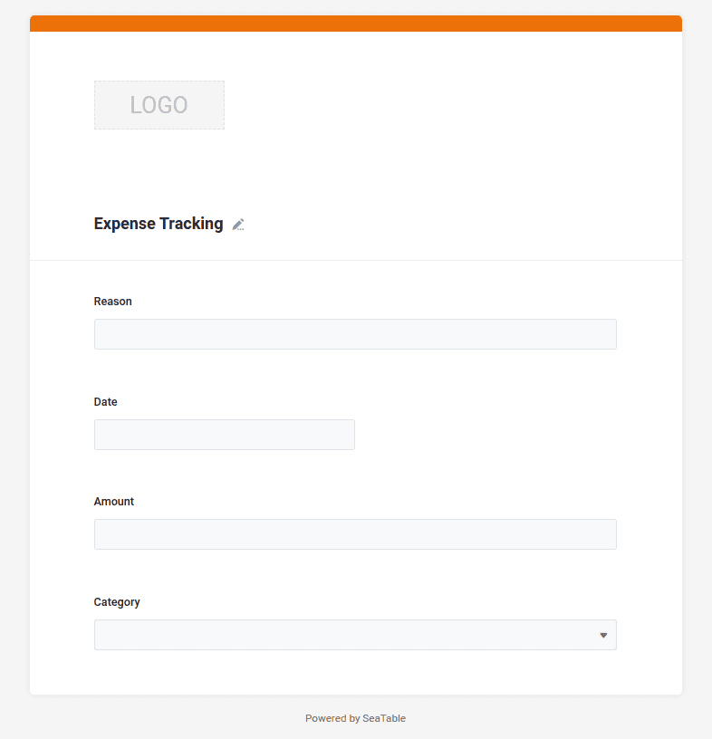

Now that we have created the necessary structure for your expense management in step 1, you can enter new expenses at any time using your browser. You probably remember: Each row represents a new data record and, in your case, a payment transaction.

But of course it would be nice if you could also record other expenses on your cell phone while you're on the move. Or you would also like to record the expenses of team colleagues or family members. For these cases, a web form is ideal, which you can easily create with SeaTable, as you have already defined the possibilities of the input form through the column types. But what do I explain long and complicated. Let's just build the form and then try it out.

## Attachment of the web form

You will find many additional functions in the header area of your base. Behind the button `Forms` SeaTable offers you the possibility to create new web forms.

1. Create a new web form with the name `Expense Tracking`. The name doesn't really matter, but why not give the form a nice name?
2. A new user interface opens in which you can design the web form.
3. Drag all four table fields `Reason`, `Date`, `Amount` and `Category` by drag-and-drop into the form.

## Further settings of the web form

Your web form is almost ready and can already be used. Nevertheless, there are still three settings that I would recommend. To adjust the settings of an input field, you need to click on the input field in the form, which will immediately display the setting options for this input field on the right-hand side. The setting options vary depending on which input field you click on.

- `Category`: The individual options should be **List** be displayed
- `Date`: The current day should already be **Default value** be set
- `Amount`: The entry of this field is mandatory **required**

The configuration of the web form is now complete and we can use it to enter the first data records.

## Trying out the web form

Use the orange buttons in the top right-hand corner to get either the URL of the web form or a QR code.

You will see that whenever you submit the form, a new data record is immediately written to your base. You do not have to reload the page in your browser.

Feel free to experiment with the web form for a few minutes and enjoy the progress you have just made: **From now on, you and anyone else you share the link to this web form with can create new entries in your base.**

It is important to note that only new entries can be created via the web form and existing entries cannot be edited or viewed.

Take a few minutes to explore the additional possibilities of the web form.

## Help article with further information

- [Web forms in general]()
- [Creating a web form]()
- [Configuration options for a web form]()
