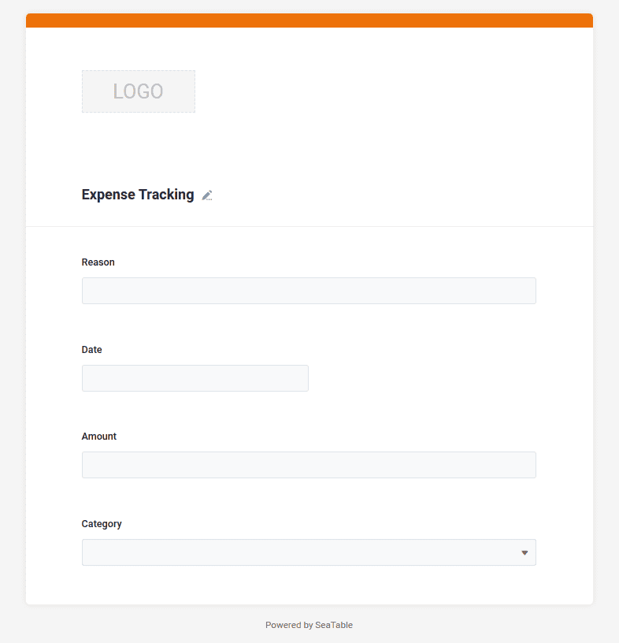

Nachdem wir in Schritt 1 die notwendige Struktur Ihrer Ausgabenverwaltung angelegt haben, können Sie nun mithilfe Ihres Browsers jederzeit neue Ausgaben erfassen. Sie erinnern sich bestimmt: Jede Zeile steht für einen neuen Datensatz und in Ihrem Fall einen Bezahlvorgang.

Doch natürlich wäre es schön, wenn Sie auch von unterwegs über Ihr Handy weitere Ausgaben erfassen könnten. Oder Sie möchten auch die Ausgaben von Teamkollegen oder Familienmitgliedern erfassen. Für diese Fälle bietet sich ein Webformular an, welches Sie mit SeaTable ganz einfach erstellen können, da Sie durch die Spaltentypen ja quasi schon die Möglichkeiten des Eingabeformulars definiert haben. Aber was erkläre ich lange und umständlich. Lassen Sie uns das Formular einfach bauen und dann ausprobieren.

## Anlage des Webformulars

Im Kopfbereich Ihrer Base finden Sie viele zusätzliche Funktionen. Hinter dem Knopf `Forms` bietet SeaTable Ihnen die Möglichkeit neue Webformulare zu erstellen.

1. Erstellen Sie ein neues Webformular mit dem Namen `Expense Tracking`. Eigentlich ist der Name egal, aber warum sollte man dem Formular nicht einen schönen Namen geben.
2. Es öffnet sich eine neue Benutzeroberfläche, in der Sie das Webformular gestalten können.
3. Ziehen Sie alle vier Tabellenfelder `Reason`, `Date`, `Amount` und `Category` per Drag-and-Drop in das Formular.

## Weitere Einstellungen des Webformulars

Ihr Webformular ist fast fertig und kann bereits genutzt werden. Trotzdem gibt es noch drei Einstellungen, die ich Ihnen empfehlen würde. Um die Einstellungen eines Eingabefeldes anzupassen, müssen Sie im Formular auf das Eingabefeld klicken, wodurch unmittelbar auf der rechten Seite die Einstellungsmöglichkeiten dieses Eingabefelds angezeigt werden. Die Einstellungsmöglichkeiten variieren je nach Eingabefeld, welches Sie anklicken.

- `Category`: Die einzelnen Optionen sollen als **Liste** dargestellt werden
- `Date`: Der aktuelle Tag soll bereits als **Standardwert** gesetzt werden
- `Amount`: Die Eingabe dieses Feldes ist zwingend **erforderlich**

Nun ist die Konfiguration des Webformulars abgeschlossen und wir können erste Datensätze darüber erfassen.

## Ausprobieren des Webformulars

Über die orangen Schaltflächen in der oberen rechten Ecke erhalten Sie entweder die URL des Webformulars oder einen QR-Code.

Sie werden sehen, dass immer, wenn Sie das Formular absenden, unmittelbar ein neuer Datensatz in Ihre Base geschrieben wird. Sie müssen die Seite in Ihrem Browser nicht neu laden.

Experimentieren Sie ruhig ein paar Minuten mit dem Webformular und genießen Sie den Fortschritt, den Sie soeben erzielt haben: **Ab sofort können Sie und jeder andere, dem Sie den Link zu diesem Webformular mitteilen, neue Einträge in Ihrer Base erstellen.**

Wichtig ist, dass über das Webformular nur neue Einträge erstellt werden können und man keine existierenden Einträge bearbeiten oder einsehen kann.

Nehmen Sie sich auch ein paar Minuten Zeit und erkunden Sie die zusätzlichen Möglichkeiten des Webformulars.

## Hilfeartikel mit weiteren Informationen

- [Webformulare im Allgemeinen]()
- [Anlegen eines Webformulars]()
- [Konfigurationsmöglichkeiten eines Webformulars]()
