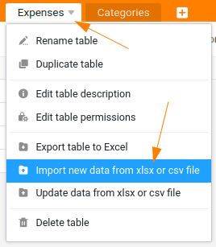

Vous avez probablement déjà saisi quelques dépenses dans votre nouvelle gestion des dépenses. Cependant, pour les étapes suivantes, nous avons besoin de quelques données supplémentaires. C'est pourquoi nous allons supprimer vos entrées actuelles et importer de nouveaux enregistrements dans le tableau.

## Suppression des anciens enregistrements

Passez à votre tableau `Expenses` et supprimez toutes les lignes saisies jusqu'à présent. Votre tableau devrait maintenant être vide.

## Importation de nouveaux enregistrements

SeaTable offre de nombreuses possibilités d'importation. Vous pouvez ainsi importer des bases entières par fichier .dtable, .csv ou .xlsx. Mais même si vous avez déjà une base, vous pouvez écrire de nouvelles données ou des données mises à jour directement dans une table. C'est ce que nous voulons faire maintenant à l'aide d'un fichier CSV. Nous aurions également pu utiliser un fichier Excel.

- Téléchargez le fichier [expenses.csv](https://seatable.io/wp-content/uploads/2024/08/expenses.csv) suivant
- Importez maintenant le fichier CSV dans le tableau `Expenses`
- Vérifiez que le tableau comporte exactement 50 entrées.

## Importation et exportation

Bien entendu, vous pouvez exporter des données, des tableaux et des bases dans SeaTable, tout comme vous pouvez les importer. Jouez donc un peu avec les différentes possibilités pour vous faire une idée de ces fonctions. Pour la suite de ce cours, l'exportation n'est pas importante.

C'est tout pour cette partie. Passons à l'étape suivante.

## Article d'aide avec plus d'informations

- [Suppression de lignes]()
- [Importation et exportation de données dans SeaTable](https://seatable.io/fr/docs/import-von-daten/datenimport-und-export/)
- [Quels sont les formats d'importation pris en charge par SeaTable ?](https://seatable.io/fr/docs/import-von-daten/welche-import-formate-unterstuetzt-seatable/)
