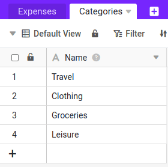

Mehrere Tabellen können in SeaTable durch Link-Spalten verknüpft werden. Im Folgenden werden wir eine zweite Tabelle mit Ausgabenkategorien hinzufügen und die beiden Tabellen miteinander verknüpfen, um dieses mächtige Feature zu demonstrieren.

## Exkurs: Vorteile der Möglichkeit zur Verknüpfung von Datensätzen

Die Verknüpfung von Datensätzen ist eine der zentralen Funktionen von SeaTable, die es deutlich von herkömmlichen Spreadsheets abhebt und ihm die Leistungsfähigkeit einer relationalen Datenbank verleiht. Das klingt komplex, ist es aber nicht, wie Sie gleich selbst erfahren werden. Hier sind die drei wichtigsten Vorteile verknüpfter Daten:

- **Mehr Übersicht**: Durch die Verknüpfung von Tabellen schaffen Sie eine klare und übersichtliche Struktur. Anstatt alle Informationen in einer einzigen Tabelle zu speichern und dabei Redundanzen zu riskieren, können Sie verwandte Daten – wie Ausgaben und Kategorien – in separaten Tabellen verwalten. So bleiben Ihre Daten konsistent und doppelte Einträge werden vermieden.
- **Flexiblere Datenanalyse**: Mit verknüpften Tabellen können Sie Daten aus verschiedenen Quellen gezielt kombinieren und auswerten. So lassen sich beispielsweise alle Ausgaben einer bestimmten Kategorie oder einer Abteilung schnell und einfach analysieren.
- **Einfachere Datenpflege**: Änderungen in einer zentralen Tabelle werden automatisch in allen verknüpften Tabellen übernommen. Dadurch bleiben Ihre Daten stets aktuell und konsistent, ohne dass Sie sie mehrfach pflegen müssen.

## Erweitern der Base Struktur

Um überhaupt Verknüpfungen anlegen zu können, benötigen wir eine zweite Tabelle, die wir nun erstellen werden.

1. Erstellen Sie eine zweite Tabelle mit dem Namen `Categories` in der gleichen Base.
2. Die Tabelle `Categories` benötigt nur eine Spalte: `Name`. Diese wird standardmäßig angelegt, somit müssen Sie hier nichts tun.
3. Fügen Sie manuell vier Einträge in die Tabelle `Categories` ein:

    - `Travel`
    - `Clothing`
    - `Groceries`
    - `Leisure`

    

4. Wechseln Sie zurück in die Tabelle `Expenses`.

5. Fügen Sie eine weitere Spalte ein. Geben Sie der neuen Spalten den Namen `Category-Link` und wählen Sie den Spaltentyp ` Link to other records` aus. Die Spalte verlinkt auf die Tabelle `Categories`. 

## Verknüpfen von Zeilen zwischen den beiden Tabellen

Um die Datensätze in beiden Tabellen nun miteinander zu verknüpfen, haben Sie zwei Möglichkeiten:

1. Sie können einem Eintrag in der Tabelle `Expenses` manuell eine Zeile aus der Tabelle `Categories` zuweisen, in dem Sie innerhalb der Zelle auf das  klicken und dann die passende Kategorie auswählen. Dies wird bei größeren Datenmengen schnell mühsam und fehleranfällig. 
2. Alternativ können Sie die [Datenverarbeitungsoptionen]() von SeaTable verwenden, um das Setzen der Verknüpfungen zu automatisieren. 

### Zellen per Datenverarbeitungsoperation verknüpfen

Legen Sie dazu eine neue Datenverarbeitungsoperation mit dem Namen `Assign Category` an und wählen Sie als Operationstyp `Auto add link` aus.

Zudem müssen Sie folgende Einstellungen setzen, damit SeaTable weiß, wie Sie Ihre Daten verknüpfen wollen:

- Tabelle: `Expenses`
- Andere Tabelle: `Categories`
- Wenn Spalte: ` Category`
- Spalte: ` Name`

Klicken Sie auf Ausführen, um die Operation auszuführen. Sie werden sehen, dass schlagartig alle Zeilen in der Tabelle `Expenses` mit einer Zeile aus der Tabelle `Categories` verknüpft wurden.



## Entfernen der unnötigen Spalte

Nachdem alle Einträge verknüpft wurden, können Sie die Spalte `Category` in der Tabelle `Expenses` löschen. Doppelt erfasste Informationen sind überflüssig und sollten vermieden werden.

## Überarbeitung des Webformulars

Wenn Sie Ihr Webformular zur Erfassung der Ausgaben nun erneut aufrufen, werden Sie feststellen, dass die Ausgabenart nicht mehr abgefragt wird. Warum ist das so? Durch das Löschen der Spalte `Category` entfällt automatisch auch die Eingabemöglichkeit im Webformular, da SeaTable keine entsprechende Spalte mehr zur Speicherung der Daten hat.

Was lernen wir daraus? Mit großer Macht kommt große Verantwortung. In SeaTable können Sie in Sekunden neue Spalten hinzufügen oder entfernen. Die meisten Anpassungen an einer Spalte sind unbedenklich. Wenn Sie jedoch Spalten löschen oder deren Typ ändern, sollten Sie kurz prüfen, ob dies Auswirkungen auf andere Komponenten hat.

Probieren Sie doch die neu hinzufügte Spalte `Category-Link` dem Webformular hinzuzufügen, damit Sie wieder wie gewohnt Ihre Ausgaben erfassen können. Bestimmt kriegen Sie das hin.

## Hilfeartikel mit weiteren Informationen

- [Eine Tabelle einer Base hinzufügen]()
- [Wie man Tabellen in SeaTable miteinander verknüpft]()
- [Datenverarbeitung Vergleichen und Verknüpfen]()
