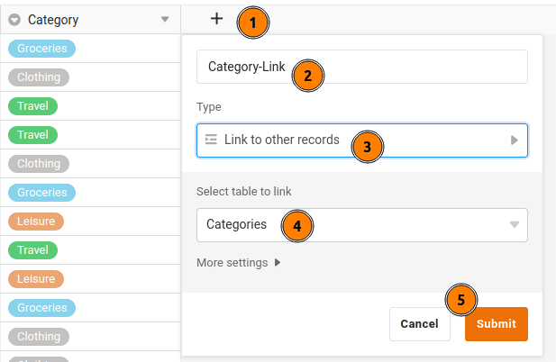
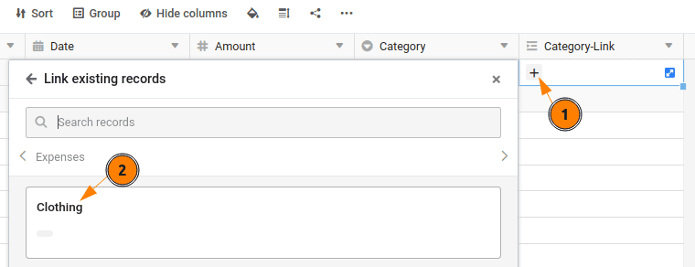
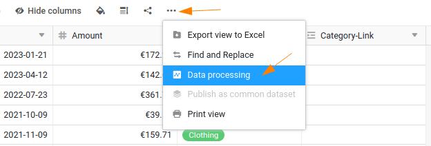
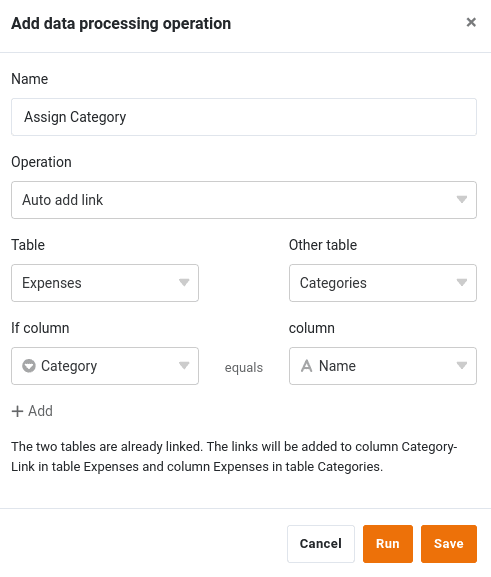

Plusieurs tableaux peuvent être liés dans SeaTable par des colonnes de liens. Dans ce qui suit, nous allons ajouter un deuxième tableau de catégories de dépenses et lier les deux tableaux pour démontrer cette puissante fonctionnalité.

## Digression : avantages de la possibilité de relier des ensembles de données

La liaison entre les enregistrements est l'une des fonctions centrales de SeaTable, ce qui le distingue nettement des feuilles de calcul traditionnelles et lui confère la puissance d'une base de données relationnelle. Cela peut paraître complexe, mais ça ne l'est pas, comme vous allez le découvrir par vous-même. Voici les trois principaux avantages des données liées :

- **Plus de clarté**: en reliant les tableaux entre eux, vous créez une structure claire et concise. Au lieu de stocker toutes les informations dans un seul tableau et de risquer des redondances, vous pouvez gérer les données apparentées - comme les dépenses et les catégories - dans des tableaux séparés. Vos données restent ainsi cohérentes et les doublons sont évités.
- **Analyse de données plus flexible**: les tableaux liés permettent de combiner et d'analyser de manière ciblée des données provenant de différentes sources. Il est par exemple possible d'analyser rapidement et facilement toutes les dépenses d'une certaine catégorie ou d'un département.
- **Une gestion des données plus simple**: les modifications apportées à une table centrale sont automatiquement répercutées dans toutes les tables liées. Vos données restent ainsi toujours à jour et cohérentes, sans que vous ayez à les gérer plusieurs fois.

## Étendre la structure de la base

Pour pouvoir créer des liens, nous avons besoin d'un deuxième tableau, que nous allons créer maintenant.

1. Créez un deuxième tableau nommé `Categories` dans la même base.
2. Le tableau `Categories` ne nécessite qu'une seule colonne : `Name`. Celle-ci est créée par défaut, vous n'avez donc rien à faire ici.
3. Ajoutez manuellement quatre entrées dans le tableau `Categories` un :

    - `Travel`
    - `Clothing`
    - `Groceries`
    - `Leisure`

    

4. Revenir au tableau `Expenses`.

5. Insérez une autre colonne. Donnez à la nouvelle colonne le nom `Category-Link` et sélectionnez le type de colonne ` Link to other records` est désactivée. La colonne renvoie au tableau `Categories`.  
   

## Relier les lignes entre les deux tableaux

Pour relier les enregistrements des deux tables, vous avez deux possibilités :

1. Vous pouvez attribuer à une entrée de la table `Expenses` manuellement une ligne de la table `Categories` en cliquant à l'intérieur de la cellule sur le bouton  puis sélectionner la catégorie appropriée. Cela devient vite fastidieux et source d'erreurs lorsque le volume de données est important.  
   
2. Vous pouvez également utiliser la [Options de traitement des données]() de SeaTable pour automatiser la mise en place des liens.  
   

### Relier les cellules par une opération de traitement des données

Pour ce faire, créez une nouvelle opération de traitement des données nommée `Assign Category` et choisissez le type d'opération `Auto add link` de.

En outre, vous devez définir les paramètres suivants pour que SeaTable sache comment vous souhaitez lier vos données :

- Tableau : `Expenses`
- Autre tableau : `Categories`
- Si colonne : ` Category`
- colonne : ` Name`

Cliquez sur Exécuter pour effectuer l'opération. Vous constaterez que toutes les lignes de la table `Expenses` avec une ligne du tableau `Categories` ont été liés.



## Supprimer la colonne inutile

Une fois que toutes les entrées ont été liées, vous pouvez modifier la colonne `Category` dans le tableau `Expenses` les supprimer. Les informations saisies deux fois sont superflues et doivent être évitées.

## Révision du formulaire web

Si vous consultez à nouveau votre formulaire web pour la saisie des dépenses, vous constaterez que le type de dépenses n'est plus demandé. Pourquoi cela ?  
En supprimant la colonne `Category` la possibilité de saisir des données dans le formulaire web disparaît automatiquement, car SeaTable ne dispose plus de la colonne correspondante pour stocker les données.

Quelle leçon en tirons-nous ? Avec un grand pouvoir vient une grande responsabilité. Dans SeaTable, vous pouvez ajouter ou supprimer des colonnes en quelques secondes. La plupart des adaptations apportées à une colonne ne présentent aucun risque. Toutefois, si vous supprimez des colonnes ou modifiez leur type, vérifiez brièvement si cela a un impact sur d'autres composants.

Essayez donc la colonne nouvellement ajoutée `Category-Link` au formulaire web afin que vous puissiez à nouveau saisir vos dépenses comme d'habitude. Je suis sûr que vous y parviendrez.

## Article d'aide avec plus d'informations

- [Ajouter un tableau à une base]()
- [Comment lier des tableaux dans SeaTable]()
- [Traitement des données Comparer et relier]()
