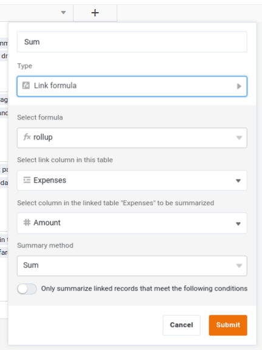

Nun haben wir die Datensätze aus beiden Tabellen miteinander verknüpft. Wichtig ist, dass diese Verknüpfung nicht einseitig ist. Wenn Sie zur Tabelle `Categories` wechseln, sehen Sie, dass auch dort eine neue Spalte hinzugefügt wurde, die die Verknüpfungen anzeigt. In unserem Fall bedeutet das: Eine Ausgabe ist mit einer Kategorie verknüpft, und eine Kategorie kann mit vielen Ausgaben verknüpft sein.

Durch die Verknüpfung haben wir bisher noch keinen direkten Nutzen erzielt, aber das wird sich jetzt ändern: Mithilfe der Verknüpfungen können wir in Sekundenschnelle statistische Auswertungen erstellen. So lässt sich zum Beispiel leicht ermitteln, wie hoch die Summe aller Ausgaben der Kategorie `Travel` ist.

## Vergrößern der Zeilenhöhe

Erhöhen Sie als Erstes die Zeilenhöhe in der Tabelle `Categories`, um mehr von den Verlinkungen sehen zu können. Sie finden die entsprechende Option `` in der Zeile über den Spaltennamen. Auch können Sie einzelne Spalten breiter ziehen, um mehr Inhalte zu sehen.

## Auswertungen der Kategorien

Legen Sie jetzt eine neue Spalte in der Tabelle `Categories` an.

> Name: `Sum`
>
> Spaltentyp: ` Link formula`
> Verwendete Formel: `rollup`
>
> Verwendete Link-Spalte: `Expenses`
>
> Verwendete Spalte für die Berechnung: ` Amount`
>
> Berechnungsmethode `Sum`

Als Nächstes können Sie noch das Format der Spalte `Sum` auf Euro umstellen, damit die dargestellten Summen entsprechend in Euro formatiert werden.

## Automatische Berechnung bei jeder Änderung

Ist das nicht fantastisch? In der Spalte `Sum` werden automatisch immer die Gesamtausgaben für jede Kategorie angezeigt. Auch wenn Sie in weitere Ausgaben in der Tabelle `Expenses` erfassen, wird die Summe sofort aktualisiert.

Selbstverständlich ist das noch nicht alles. Sie könnten die Auswertung auf einzelne Jahre einschränken oder zusätzliche Bedingungen hinzufügen. Wenn Sie etwas mehr Erfahrung mit SeaTable sammeln, werden Sie solche Auswertungen mit wenigen Klicks erstellen können.

Damit sind wir auch schon am Ende dieses Abschnitts. Scrollen Sie bis zum Ende und springen Sie zum sechsten und vorletzten Thema dieses Online-Kurses.



## Hilfeartikel mit weiteren Informationen

- [Zeilenhöhe anpassen]()
- [Die Rollup-Formel]()
