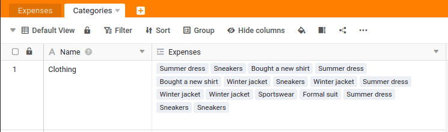

Ligámos agora os registos de dados de ambas as tabelas. É importante que esta ligação não seja unilateral. Se ligar à tabela `Categories` verá que também foi adicionada uma nova coluna, que mostra as ligações. No nosso caso, isto significa que um problema está ligado a uma categoria e que uma categoria pode estar ligada a muitos problemas.

Ainda não obtivemos quaisquer benefícios diretos da ligação, mas isso está prestes a mudar: Com a ajuda das ligações, podemos criar análises estatísticas numa questão de segundos. Por exemplo, podemos determinar facilmente qual o valor total de todas as despesas na categoria `Travel` é.

## Aumentar a altura da linha

Em primeiro lugar, aumentar a altura da linha na tabela `Categories`para ver mais ligações. Encontrará a opção correspondente `` na linha acima do nome da coluna. Também pode arrastar colunas individuais para ver mais conteúdo.

## Análise das categorias

Agora crie uma nova coluna na tabela `Categories` para.

> Nome: `Sum`  
> Tipo de coluna: ` Link formula`  
> Fórmula utilizada: `rollup`  
> Coluna de ligação utilizada: `Expenses`  
> Coluna utilizada para o cálculo: ` Amount`  
> Método de cálculo `Sum`

Em seguida, é possível alterar o formato da coluna `Sum` para euros, para que os totais apresentados sejam formatados em euros.

## Cálculo automático em cada alteração

Não é fantástico? Na coluna `Sum` o total das despesas de cada categoria é sempre apresentado automaticamente. Mesmo que se clique noutras despesas no `Expenses` o total é atualizado imediatamente.

É claro que isto não é tudo. Pode limitar a análise a anos individuais ou acrescentar condições adicionais. À medida que for ganhando mais experiência com o SeaTable, será capaz de criar tais análises com apenas alguns cliques.

Chegamos assim ao fim desta secção. Desloque-se até ao fim e passe para o sexto e penúltimo tópico deste curso online.



## Artigo de ajuda com mais informações

- [Ajustar a altura da fila]()
- [A fórmula de enrolar](https://seatable.io/pt/docs/verknuepfungen/die-rollup-formel/)
