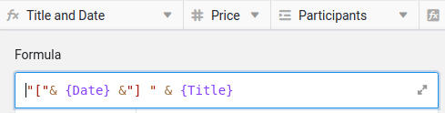

Bevor Sie in SeaTable einen neuen Geschäftsprozess abbilden können, müssen Sie zunächst die passende Tabellenstruktur erstellen. Nur so können Sie die benötigten Daten für den Prozess sinnvoll erfassen und später effizient verarbeiten. Sie können sich zwar von den zahlreichen Vorlagen inspirieren lassen, doch in der Regel ist es notwendig, den Prozess genau zu durchdenken und die relevanten Daten klar zu definieren.

Da es in diesem Kurs um die Verwaltung von Online-Dienstleistungen geht, benötigen wir zwei zentrale Tabellen:

- Eine Tabelle zur Erfassung der Kursangebote
- Eine Tabelle für die Teilnehmer

Im ersten Kurs haben Sie bereits gelernt, wie Sie eine Base mit verschiedenen Spaltentypen erstellen. Daher überspringen wir diesen Schritt und beginnen direkt mit einer vorbereiteten Grundlage.

Laden Sie die folgende Datei auf Ihren PC herunter und importieren Sie diese auf der Startseite von SeaTable als neue Base:

[SeaTable Course Level 2.dtable](/SeaTable-Course-Level-2.dtable)

Auch wenn Sie die Base nicht selbst erstellen müssen, ist es wichtig, dass Sie sich intensiv mit der Struktur vertraut machen. Es wurden neue Spaltentypen verwendet, die Sie eventuell aus dem vorherigen Kurs noch nicht kennen.

## Die Komponenten der Base

Auf den ersten Blick wirkt die Base recht übersichtlich. Sie besteht lediglich aus:

- 2 Tabellen
- 18 Spalten
- 3 Ansichten
- 1 Webformular

Doch lassen Sie sich von der Einfachheit nicht täuschen: Diese Struktur ist erstaunlich leistungsfähig. Im Folgenden erkläre ich, warum wir die Base auf diese Weise gestaltet haben.

### Ihr Kursangebot im Überblick

In der Tabelle `Courses` finden Sie alle wichtigen Informationen zu Ihren Angeboten. Jede Zeile repräsentiert einen Kurs oder eine Dienstleistung, die Sie anbieten. Die einzelnen Spalten liefern detaillierte Angaben, wie z. B.:

- Kursname
- Datum und Ort des Kurses
- Anzahl der angemeldeten Teilnehmer
- Status des Kurses (ausgebucht oder noch Plätze frei)

Diese strukturierte Übersicht ermöglicht es Ihnen, jederzeit den Überblick über Ihre Kurse und Teilnehmerzahlen zu behalten.



### Alles Wichtige zu Ihren Kursteilnehmern

In der Tabelle `Registrations` werden alle Daten zu den Personen erfasst, die sich für Ihre Kurse angemeldet haben. Jede Zeile steht für einen Teilnehmer und enthält folgende Informationen:

- Name des Teilnehmers
- E-Mail-Adresse
- Der Kurs, für den sich die Person angemeldet hat
- Zahlungsstatus (ob bereits bezahlt wurde)

Diese Tabelle gibt Ihnen jederzeit einen klaren Überblick über den aktuellen Anmeldestand und den Status der Zahlungen.



## Weitere Besonderheiten

Einige Funktionen dieser Base werden erst durch bestimmte Konfigurationen verständlich. Bitte lesen Sie die folgenden Erklärungen aufmerksam durch, damit Sie die nachfolgenden Abschnitte besser nachvollziehen können.

### Formelspalten

In der Tabelle `Courses` finden Sie zwei wichtige Formelspalten, deren Nutzen ich Ihnen gerne erläutern möchte:

- ` Title and Date`
- ` Status`

` Title and Date` ist eine Hilfsspalte, die die Werte aus den Spalten „Title“ und „Date“ miteinander verknüpft. Die verwendete Formel ist sehr einfach und fügt lediglich den Kurstitel und das Kursdatum zusammen.

Auf den ersten Blick scheint diese Spalte überflüssig zu sein, da sie nur vorhandene Daten kombiniert. Aber vertrauen Sie mir: Wenn wir gleich das Anmeldeformular analysieren, werden Sie verstehen, warum diese Spalte äußerst nützlich ist.

---

Die Formelspalte ` Status` ermittelt automatisch, ob in einem Kurs noch Plätze verfügbar sind oder ob der Kurs bereits ausgebucht ist. Die Logik dahinter ist relativ simpel, könnte jedoch bei einem produktiven Einsatz auch das Veranstaltungsdatum berücksichtigen.



### Ansicht zur Auswahl von verfügbaren Kursen

In der Tabelle `Courses` gibt es eine spezielle Ansicht namens ` Available Courses`. Diese Ansicht filtert die Formelspalte ` Status` und zeigt ausschließlich Kurse an, bei denen noch Plätze frei sind. Ausgebuchte Kurse werden automatisch ausgeblendet.

Diese Ansicht ist gegen weitere Bearbeitung gesperrt , um sicherzustellen, dass sie unverändert bleibt. Sie spielt eine wichtige Rolle, da sie die Auswahlmöglichkeiten in der Link-Spalte ` Registered for` begrenzt.

Wenn wir uns gleich das Anmeldeformular genauer anschauen, wird deutlich, warum diese Ansicht so hilfreich ist.

### Farbige Markierung von Zeilen und Spalten

SeaTable bietet die Möglichkeit, Zeilen, Spalten und Zellen farblich hervorzuheben. In diesem Template sind zwei solcher Effekte bereits integriert:

- Die Zeilen der Kurse werden je nach Status markiert: Kurse mit freien Plätzen sind grün hervorgehoben, während ausgebuchte Kurse rot gekennzeichnet sind.
- Die Kurspreise sind je nach Höhe farblich abgestuft: Je teurer der Kurs, desto dunkler die Markierung.

## Machen Sie sich vertraut mit der Base

Nehmen Sie sich ausreichend Zeit, um die Base im Detail zu erkunden. Sollten Ihnen bestimmte Funktionen noch unbekannt sein, zögern Sie nicht, die verlinkten Hilfeartikel zu lesen.

## Hilfeartikel mit weiteren Informationen

- [Erstellen einer Base aus einer DTABLE-Datei]()
- [Grundlagen von SeaTable Formeln]()
- [Farbliche Markierung von Zeilen]()
- [Ansichten sperren]()
