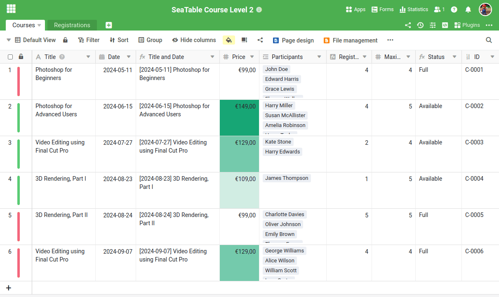

Antes de poder asignar un nuevo proceso de negocio en SeaTable, primero debe crear la estructura de tabla adecuada. Es la única forma de registrar los datos necesarios para el proceso de forma significativa y procesarlos posteriormente de forma eficaz. Aunque puede inspirarse en las numerosas plantillas, normalmente es necesario pensar el proceso en detalle y definir claramente los datos relevantes.

Como este curso trata de la gestión de servicios en línea, necesitamos dos tablas centrales:

- Un cuadro para registrar la oferta de cursos
- Una mesa para los participantes

En el primer curso ya ha aprendido a crear una base con distintos tipos de columnas. Por lo tanto, nos saltaremos este paso y empezaremos directamente con una base preparada.

Descargue el siguiente archivo a su PC e impórtelo como una nueva base en la página de inicio de SeaTable:

[Curso SeaTable Nivel 2.dtable](/SeaTable-Course-Level-2.dtable)

Aunque no tenga que crear usted mismo la base, es importante que se familiarice a fondo con la estructura. Se han utilizado nuevos tipos de columnas que quizá no conozca del curso anterior.

## Los componentes de la base

A primera vista, la base parece bastante clara. Sólo consta de:

- 2 Mesas
- 18 columnas
- 3 vistas
- 1 Formulario web

Pero no te dejes engañar por su sencillez: Esta estructura es asombrosamente potente. A continuación explico por qué hemos diseñado la base de esta manera.

### Su programa de estudios de un vistazo

En la tabla `Courses` encontrará toda la información importante sobre sus ofertas. Cada fila representa un curso o servicio que usted ofrece. Las columnas individuales proporcionan información detallada, como

- Nombre del curso
- Fecha y lugar del curso
- Número de participantes inscritos
- Estado del curso (completo o plazas disponibles)

Esta visión de conjunto estructurada le permite realizar un seguimiento de sus cursos y del número de participantes en todo momento.



### Todo lo que necesita saber sobre los participantes en su curso

En la tabla `Registrations` se registran todos los datos de las personas que se han inscrito en sus cursos. Cada línea representa a un participante y contiene la siguiente información:

- Nombre del participante
- Dirección de correo electrónico
- El curso en el que la persona se ha inscrito
- Estado del pago (si ya se ha efectuado el pago)

Este cuadro le ofrece en todo momento una visión clara del estado actual del registro y de la situación de los pagos.



## Otras particularidades

Algunas funciones de esta base sólo pueden entenderse a través de determinadas configuraciones. Lea atentamente las siguientes explicaciones para comprender mejor las secciones siguientes.

### Columnas de fórmulas

En la tabla `Courses` encontrará dos importantes columnas de fórmulas, cuyas ventajas me gustaría explicarle:

- ` Title and Date`
- ` Status`

` Title and Date` es una columna auxiliar que une los valores de las columnas "Título" y "Fecha". La fórmula utilizada es muy sencilla y sólo combina el título y la fecha del curso.

A primera vista, esta columna parece superflua, ya que sólo combina los datos existentes. Pero créame: cuando analicemos el formulario de registro dentro de un momento, entenderá por qué esta columna es extremadamente útil.

---

La columna de fórmulas ` Status` determina automáticamente si aún quedan plazas disponibles en un curso o si el curso ya está completo. La lógica detrás de esto es relativamente simple, pero también podría tener en cuenta la fecha del evento cuando se utiliza de manera productiva.



### Vista para seleccionar los cursos disponibles

En la tabla `Courses` existe una vista especial denominada ` Available Courses`. Esta vista filtra la columna de fórmulas ` Status` y sólo muestra los cursos para los que aún quedan plazas disponibles. Los cursos que están completos se ocultan automáticamente.

Esta vista está bloqueada para que no se pueda editar para garantizar que no se modifica. Desempeña un papel importante, ya que determina las opciones de selección en la columna de enlaces. ` Registered for` limitado.

Si nos fijamos más detenidamente en el formulario de registro, queda claro por qué este punto de vista es tan útil.

### Marcado por colores de filas y columnas

SeaTable ofrece la posibilidad de resaltar en color filas, columnas y celdas. Dos de estos efectos ya están integrados en esta plantilla:

- Las filas de los cursos se resaltan según su estado: Los cursos con plazas libres se resaltan en verde, mientras que los cursos con plazas completas se marcan en rojo.
- Los precios de los cursos se clasifican por colores en función del importe: Cuanto más caro es el precio, más oscuro es el color.

## Familiarícese con la base

Tómese el tiempo suficiente para explorar la base en detalle. Si aún no está familiarizado con determinadas funciones, no dude en leer los artículos de ayuda enlazados.

## Artículo de ayuda con más información

- [Creación de una base a partir de un archivo DTABLE]()
- [Fórmulas básicas de SeaTable]()
- [Codificación por colores de las líneas]()
- [Vistas de la cerradura]()
