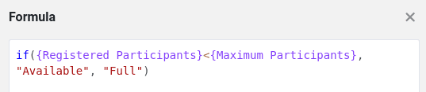

Avant de pouvoir représenter un nouveau processus de gestion dans SeaTable, vous devez d'abord créer la structure de tableau appropriée. C'est la seule façon de saisir judicieusement les données nécessaires au processus et de les traiter efficacement par la suite. Vous pouvez certes vous inspirer des nombreux modèles proposés, mais il est généralement nécessaire de bien réfléchir au processus et de définir clairement les données pertinentes.

Comme ce cours porte sur la gestion des services en ligne, nous avons besoin de deux tableaux centraux :

- Un tableau pour recenser les offres de cours
- Un tableau pour les participants

Dans le premier cours, vous avez déjà appris à créer une base avec différents types de colonnes. Nous allons donc sauter cette étape et commencer directement avec une base préparée.

Téléchargez le fichier suivant sur votre PC et importez-le comme nouvelle base sur la page d'accueil de SeaTable :

[SeaTable Course Niveau 2.dtable](/SeaTable-Course-Level-2.dtable)

Même si vous ne devez pas créer la base vous-même, il est important que vous vous familiarisiez intensivement avec sa structure. De nouveaux types de colonnes ont été utilisés, que vous n'avez peut-être pas encore rencontrés dans le cours précédent.

## Les composants de la base

Au premier coup d'œil, la base semble assez claire. Elle se compose uniquement de

- 2 tableaux
- 18 colonnes
- 3 vues
- 1 formulaire web

Mais ne vous laissez pas tromper par sa simplicité : Cette structure est étonnamment puissante. J'explique ci-dessous pourquoi nous avons conçu la base de cette manière.

### Aperçu de votre offre de cours

Dans le tableau `Courses` vous trouverez toutes les informations importantes sur vos offres. Chaque ligne représente un cours ou un service que vous proposez. Les différentes colonnes fournissent des informations détaillées, comme par exemple

- Nom du cours
- Date et lieu du cours
- Nombre de participants inscrits
- Statut du cours (complet ou places encore disponibles)

Cet aperçu structuré vous permet de garder à tout moment une vue d'ensemble de vos cours et du nombre de participants.



### Tout ce qu'il faut savoir sur les participants à vos cours

Dans le tableau `Registrations` permet de saisir toutes les données relatives aux personnes qui se sont inscrites à vos cours. Chaque ligne représente un participant et contient les informations suivantes :

- Nom du participant
- Adresse électronique
- Le cours auquel la personne s'est inscrite
- Statut de paiement (si le paiement a déjà été effectué)

Ce tableau vous donne à tout moment un aperçu clair de l'état actuel des inscriptions et du statut des paiements.



## Autres particularités

Certaines fonctions de cette base ne sont compréhensibles qu'après certaines configurations. Veuillez lire attentivement les explications suivantes afin de mieux comprendre les sections qui suivent.

### Colonnes de formules

Dans le tableau `Courses` vous trouverez deux colonnes de formules importantes dont j'aimerais vous expliquer l'utilité :

- ` Title and Date`
- ` Status`

` Title and Date` est une colonne auxiliaire qui combine les valeurs des colonnes "Titre" et "Date". La formule utilisée est très simple et se contente d'assembler le titre et la date du cours.

A première vue, cette colonne semble superflue, car elle ne fait que combiner des données existantes. Mais faites-moi confiance : si nous analysons tout de suite le formulaire d'inscription, vous comprendrez pourquoi cette colonne est extrêmement utile.

---

La colonne de formules ` Status` détermine automatiquement s'il y a encore des places disponibles dans un cours ou si le cours est déjà complet. La logique sous-jacente est relativement simple, mais pourrait également tenir compte de la date de l'événement si elle était utilisée de manière productive.



### Vue permettant de sélectionner les cours disponibles

Dans le tableau `Courses` il existe une vue spéciale appelée ` Available Courses`. Cette vue filtre la colonne de formules ` Status` et affiche uniquement les cours pour lesquels des places sont encore disponibles. Les cours complets sont automatiquement masqués.

Cette vue est verrouillée pour empêcher toute modification pour s'assurer qu'elle reste inchangée. Elle joue un rôle important, car elle détermine les choix possibles dans la colonne des liens. ` Registered for` limitée.

Si nous examinons tout de suite le formulaire d'inscription de plus près, nous verrons pourquoi cette vue est si utile.

### Marquage en couleur des lignes et des colonnes

SeaTable offre la possibilité de mettre en évidence les lignes, les colonnes et les cellules par des couleurs. Deux effets de ce type sont déjà intégrés dans ce modèle :

- Les lignes des cours sont marquées en fonction de leur statut : Les cours avec des places libres sont mis en évidence en vert, tandis que les cours complets sont marqués en rouge.
- Les prix des cours sont classés par couleur en fonction de leur montant : Plus le cours est cher, plus le marquage est foncé.

## Familiarisez-vous avec la base

Prenez suffisamment de temps pour explorer la base en détail. Si certaines fonctions vous sont encore inconnues, n'hésitez pas à consulter les articles d'aide en lien.

## Article d'aide avec plus d'informations

- [Création d'une base à partir d'un fichier DTABLE]()
- [Principes de base des formules SeaTable]()
- [Marquage des lignes en couleur]()
- [Verrouiller les vues]()
