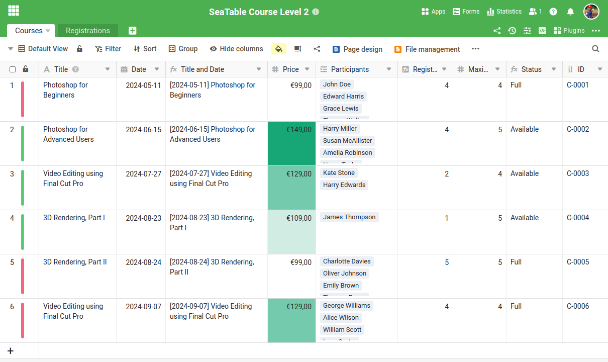
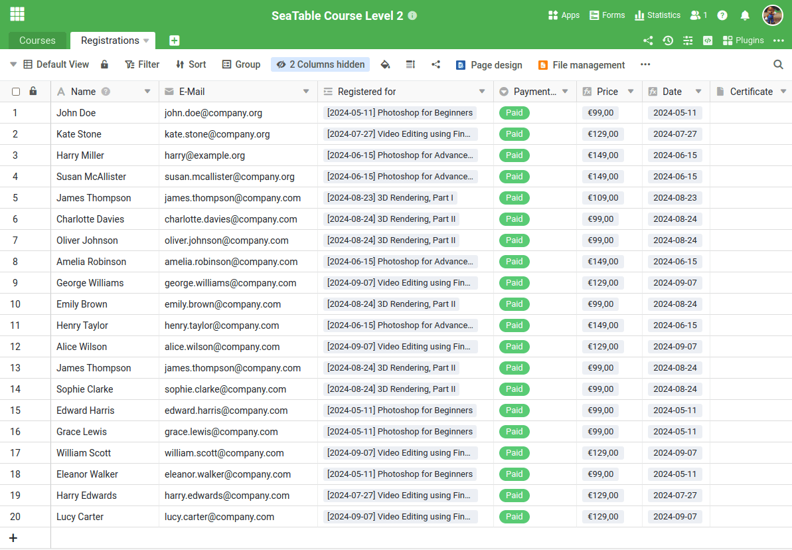
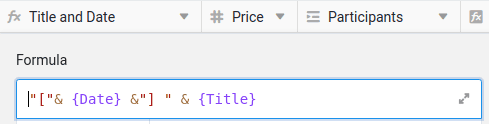
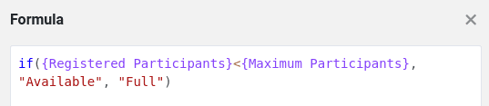
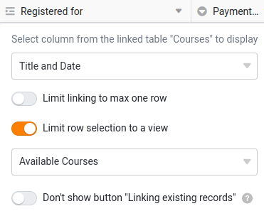

Antes de poder mapear um novo processo empresarial no SeaTable, é necessário criar primeiro a estrutura de tabela adequada. Esta é a única forma de registar os dados necessários para o processo de uma forma significativa e processá-los eficientemente mais tarde. Embora se possa inspirar nos inúmeros modelos, normalmente é necessário pensar no processo em pormenor e definir claramente os dados relevantes.

Como este curso é sobre a gestão de serviços em linha, precisamos de duas tabelas centrais:

- Um quadro para registar as ofertas de cursos
- Uma mesa para os participantes

No primeiro curso, já aprendeu a criar uma base com diferentes tipos de colunas. Por isso, vamos saltar esta etapa e começar diretamente com uma base preparada.

Descarregue o seguinte ficheiro para o seu PC e importe-o como uma nova base na página inicial do SeaTable:

[Curso SeaTable Nível 2.dtable](https://seatable.io/wp-content/uploads/2024/09/SeaTable-Course-Level-2.dtable)

Mesmo que não tenha de ser o próprio a criar a base, é importante que se familiarize intensamente com a estrutura. Foram utilizados novos tipos de colunas com os quais pode não estar familiarizado desde o curso anterior.

## Os componentes da base

À primeira vista, a base parece bastante clara. É constituída apenas por:

- 2 Tabelas
- 18 colunas
- 3 visualizações
- 1 Formulário Web

Mas não se deixe enganar pela sua simplicidade: Esta estrutura é incrivelmente poderosa. A seguir, explico porque é que concebemos a base desta forma.

### O programa do curso num relance

Na tabela `Courses` encontrará todas as informações importantes sobre as suas ofertas. Cada linha representa um curso ou serviço que oferece. As colunas individuais fornecem informações pormenorizadas, tais como

- Nome do curso
- Data e local do curso
- Número de participantes registados
- Situação do curso (totalmente reservado ou lugares ainda disponíveis)

Esta visão geral estruturada permite-lhe manter sempre um registo dos seus cursos e do número de participantes.



### Tudo o que precisa de saber sobre os participantes na sua disciplina

Na tabela `Registrations` são registados todos os dados sobre as pessoas que se inscreveram nos seus cursos. Cada linha representa um participante e contém as seguintes informações:

- Nome do participante
- Endereço de correio electrónico
- O curso para o qual a pessoa se inscreveu
- Estado do pagamento (se o pagamento já foi efectuado)

Este quadro dá-lhe uma visão clara do estado atual do registo e do estado dos pagamentos em qualquer altura.



## Outras caraterísticas especiais

Algumas funções desta base só podem ser compreendidas através de determinadas configurações. Leia atentamente as explicações que se seguem para compreender melhor as secções seguintes.

### Colunas de fórmula

Na tabela `Courses` encontrará duas colunas de fórmulas importantes, cujas vantagens gostaria de lhe explicar:

- ` Title and Date`
- ` Status`

` Title and Date` é uma coluna auxiliar que associa os valores das colunas "Título" e "Data". A fórmula utilizada é muito simples e combina apenas o título e a data da disciplina.

À primeira vista, esta coluna parece supérflua, uma vez que apenas combina dados existentes. Mas confie em mim: quando analisarmos o formulário de registo, compreenderá porque é que esta coluna é extremamente útil.

---

A coluna da fórmula ` Status` determina automaticamente se ainda há lugares disponíveis numa disciplina ou se a disciplina já está totalmente reservada. A lógica subjacente é relativamente simples, mas também pode ter em conta a data do evento quando utilizada de forma produtiva.



### Ver para selecionar cursos disponíveis

Na tabela `Courses` existe uma vista especial chamada ` Available Courses`. Esta vista filtra a coluna de fórmulas ` Status` e mostra apenas os cursos para os quais ainda há lugares disponíveis. Os cursos que estão totalmente reservados são automaticamente ocultados.

Esta vista está bloqueada contra outras edições para garantir que se mantém inalterado. Desempenha um papel importante, pois determina as opções de seleção na coluna da ligação. ` Registered for` limitado.

Se olharmos com mais atenção para o formulário de registo, torna-se claro porque é que esta visão é tão útil.

### Marcação colorida de linhas e colunas

O SeaTable oferece a opção de realçar linhas, colunas e células com cores. Dois desses efeitos já estão integrados neste modelo:

- As linhas de cursos são destacadas de acordo com o seu estado: Os cursos com lugares livres estão assinalados a verde, enquanto os cursos totalmente reservados estão assinalados a vermelho.
- Os preços dos cursos são classificados por cores, consoante o montante: Quanto mais caro for o preço, mais escura é a cor.

## Familiarizar-se com a base

Reserve tempo suficiente para explorar a base em pormenor. Se ainda não estiver familiarizado com determinadas funções, não hesite em ler os artigos de ajuda associados.

## Artigo de ajuda com mais informações

- [Criação de uma Base a partir de um ficheiro DTABLE](https://seatable.io/pt/docs/import-von-daten/erstellen-einer-base-aus-einer-dtable-datei/)
- [Noções básicas das fórmulas SeaTable](https://seatable.io/pt/docs/formeln/grundlagen-von-seatable-formeln/)
- [Marcação a cores das linhas]()
- [Vistas de bloqueio](https://seatable.io/pt/docs/ansichtsoptionen/ansicht-sperren/)
