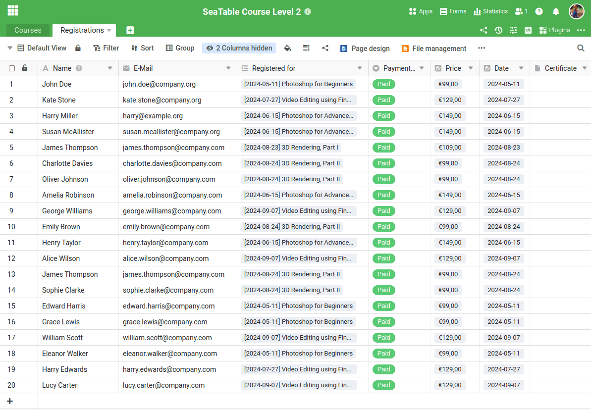
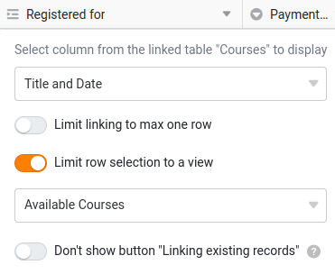

Прежде чем приступить к созданию нового бизнес-процесса в SeaTable, необходимо создать соответствующую структуру таблиц. Это единственный способ записать данные, необходимые для процесса, в осмысленном виде и эффективно обработать их в дальнейшем. Хотя вы можете вдохновиться многочисленными шаблонами, обычно необходимо детально продумать процесс и четко определить соответствующие данные.

Поскольку этот курс посвящен управлению онлайн-сервисами, нам понадобятся две центральные таблицы:

- Таблица для записи предлагаемых курсов
- Стол для участников

В первом курсе вы уже узнали, как создать базу с различными типами колонок. Поэтому мы пропустим этот шаг и начнем непосредственно с подготовленной базы.

Загрузите следующий файл на свой компьютер и импортируйте его как новую базу на стартовой странице SeaTable:

[Курс SeaTable Уровень 2.dtable](https://seatable.io/wp-content/uploads/2024/09/SeaTable-Course-Level-2.dtable)

Даже если вам не придется создавать базу самостоятельно, важно, чтобы вы хорошо ознакомились с ее структурой. В ней используются новые типы колонок, с которыми вы, возможно, не знакомы по предыдущему курсу.

## Компоненты базы

На первый взгляд, база выглядит вполне понятной. Она состоит только из:

- 2 стола
- 18 колонн
- 3 вида
- 1 Веб-форма

Но пусть вас не обманывает его простота: Эта структура удивительно мощная. Ниже я объясню, почему мы спроектировали базу именно таким образом.

### Программа вашего курса с первого взгляда

В таблице `Courses` вы найдете всю важную информацию о ваших предложениях. Каждая строка представляет собой курс или услугу, которую вы предлагаете. Отдельные столбцы содержат подробную информацию, например

- Название курса
- Дата и место проведения курса
- Количество зарегистрированных участников
- Статус курса (полностью забронирован или места еще есть)

Этот структурированный обзор позволит вам всегда отслеживать количество курсов и участников.



### Все, что вам нужно знать о слушателях курса

В таблице `Registrations` записываются все данные о людях, которые зарегистрировались на ваши курсы. Каждая строка представляет одного участника и содержит следующую информацию:

- Имя участника
- Адрес электронной почты
- Курс, на который человек зарегистрировался
- Статус платежа (был ли уже произведен платеж)

В этой таблице вы всегда сможете увидеть текущий статус регистрации и состояние платежей.



## Другие особенности

Некоторые функции этой базы могут быть понятны только через определенные конфигурации. Пожалуйста, внимательно прочитайте следующие пояснения, чтобы лучше понять следующие разделы.

### Колонки формул

В таблице `Courses` вы найдете два важных столбца формул, преимущества которых я хотел бы вам объяснить:

- ` Title and Date`
- ` Status`

` Title and Date` это вспомогательный столбец, который соединяет значения из столбцов "Название" и "Дата". Используемая формула очень проста и объединяет только название курса и его дату.

На первый взгляд, этот столбец кажется лишним, поскольку он лишь объединяет существующие данные. Но поверьте мне: когда мы вкратце разберем форму регистрации, вы поймете, почему этот столбец чрезвычайно полезен.

---

Колонка формул ` Status` автоматически определяет, есть ли еще свободные места в курсе или он уже полностью забронирован. Логика, лежащая в основе этого, относительно проста, но при продуктивном использовании можно также учитывать дату события.



### Просмотр для выбора доступных курсов

В таблице `Courses` существует специальное представление, называемое ` Available Courses`. Это представление фильтрует столбец формул ` Status` и показывает только те курсы, на которые еще есть свободные места. Курсы, которые полностью забронированы, автоматически скрываются.

Этот вид заблокирован от дальнейшего редактирования чтобы он оставался неизменным. Он играет важную роль, поскольку определяет варианты выбора в колонке ссылок. ` Registered for` ограниченный.

Если мы внимательно посмотрим на регистрационную форму, то станет понятно, почему это представление так полезно.

### Цветная маркировка строк и столбцов

SeaTable предлагает возможность выделения строк, столбцов и ячеек цветом. Два таких эффекта уже интегрированы в этот шаблон:

- Строки курсов выделены в соответствии с их статусом: Курсы со свободными местами выделены зеленым цветом, а полностью забронированные курсы - красным.
- Цены на курсы градируются по цвету в зависимости от суммы: Чем дороже цена, тем темнее цвет.

## Ознакомьтесь с базой

Уделите достаточно времени детальному изучению базы. Если вы все еще не знакомы с некоторыми функциями, не стесняйтесь читать связанные с ними справочные статьи.

## Справочная статья с дополнительной информацией

- [Создание базы из файла DTABLE](https://seatable.io/ru/docs/import-von-daten/erstellen-einer-base-aus-einer-dtable-datei/)
- [Основы формул SeaTable](https://seatable.io/ru/docs/formeln/grundlagen-von-seatable-formeln/)
- [Цветовая маркировка линий](https://seatable.io/ru/docs/ansichtsoptionen/farbliche-markierung-von-zellen/)
- [Виды замков](https://seatable.io/ru/docs/ansichtsoptionen/ansicht-sperren/)
