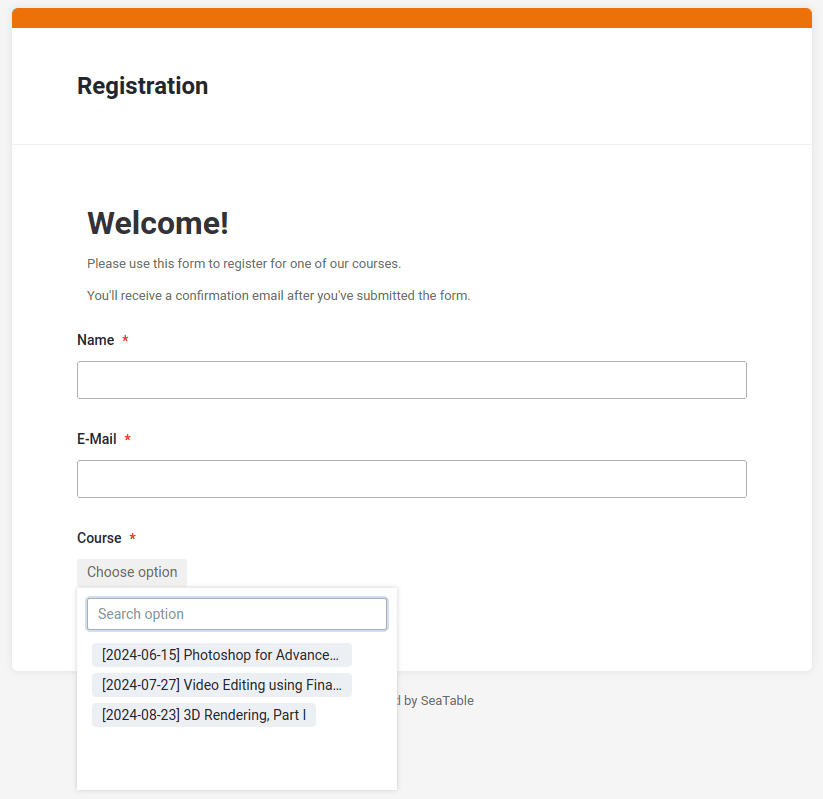

Als Nächstes widmen wir uns dem Webformular. Da Sie bereits im ersten Online-Kurs gelernt haben, wie man ein Webformular mit SeaTable erstellt, müssen Sie dies nicht erneut tun. Das Webformular ist bereits in das Template integriert.

Öffnen Sie nun das Webformular im Bearbeitungsmodus, und wir besprechen kurz die wichtigsten Punkte.

## Das Webformular und die Kursauswahl

Das Webformular ist bewusst einfach gehalten und fragt lediglich drei Werte ab:

- Name
- E-Mail
- Kurs

Alle drei Felder sind als Pflichtfelder definiert. Die Felder **Name** und **E-Mail** benötigen keine weitere Erklärung.

Das Besondere liegt in der Kursauswahl: Hier können nur Kurse ausgewählt werden, die noch über freie Plätze verfügen. Probieren Sie es selbst aus: Wenn Sie auf das Auswahlfeld klicken, werden Ihnen nur drei Kurse angezeigt, obwohl in der Tabelle insgesamt fünf Kurse erfasst sind.

Warum ist das so? Wir haben die Auswahl in der Link-Spalte auf die Ansicht ` Available Courses` beschränkt, die nur Kurse mit freien Plätzen anzeigt. Dadurch sehen Sie im Webformular nur die Kurse, die in dieser Ansicht verfügbar sind.

SeaTable berücksichtigt diese Einschränkung und stellt sicher, dass auch im Webformular nur Kurse angeboten werden, die noch nicht ausgebucht sind.

## Hilfeartikel mit weiteren Informationen

- [Wie man Tabellen in SeaTable miteinander verknüpft]()
- [Konfigurationsmöglichkeiten eines Webformulars]()
