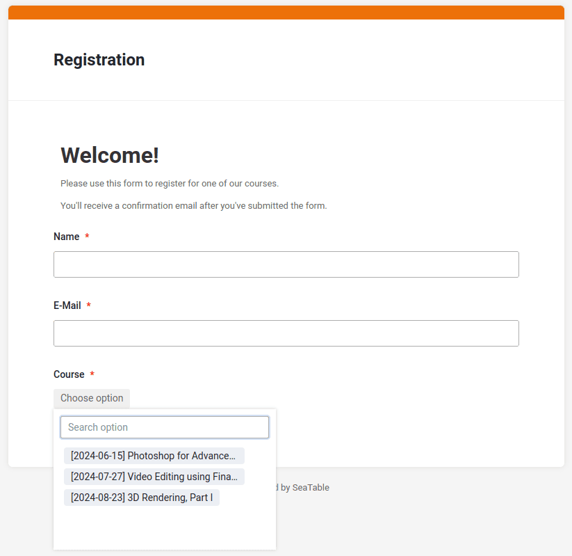

De seguida, vamos concentrar-nos no formulário Web. Como já aprendeu a criar um formulário Web com o SeaTable no primeiro curso online, não precisa de o fazer novamente. O formulário Web já está integrado no modelo.

Agora, abra o formulário Web no modo de edição e vamos discutir brevemente os pontos mais importantes.

## O formulário Web e a seleção de cursos

O formulário Web é deliberadamente simples e apenas pede três valores:

- Nome
- Correio electrónico
- Curso

Os três campos são definidos como campos obrigatórios. Os campos **Nome** e **E-mail** não requerem qualquer explicação adicional.

A caraterística especial é a seleção de cursos: Aqui só pode selecionar os cursos que ainda têm lugares disponíveis. Experimente por si próprio: Se clicar no campo de seleção, apenas são apresentados três cursos, embora a tabela apresente um total de cinco cursos.

Porquê? Alterámos a seleção na coluna de ligação para a vista ` Available Courses` que mostra apenas as disciplinas com lugares livres. Isto significa que só verá os cursos que estão disponíveis nesta vista do formulário Web.

O SeaTable tem em conta esta restrição e garante que apenas os cursos que ainda não estão totalmente reservados são oferecidos no formulário Web.

## Artigo de ajuda com mais informações

- [Como ligar as tabelas em SeaTable](https://seatable.io/pt/docs/verknuepfungen/wie-man-tabellen-in-seatable-miteinander-verknuepft/)
- [Opções de configuração de um formulário web]()
