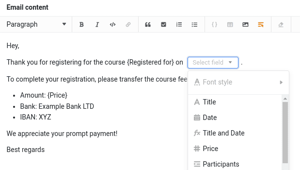

Nun fügen wir die Funktion hinzu, dass Teilnehmer, die sich für einen Kurs angemeldet haben, eine Anmeldebestätigung sowie eine Zahlungsaufforderung per E-Mail erhalten.

## E-Mailversand mit SeaTable

Um E-Mails mit SeaTable zu verschicken, müssen Sie zunächst ein E-Mail-Konto in der Base hinterlegen. Da die Konfiguration je nach Anbieter unterschiedlich ist, empfehlen wir die Nutzung von [mailtrap](https://mailtrap.io). _Mailtrap_ ermöglicht es Ihnen, E-Mails in ein virtuelles Postfach zu senden, was den Vorteil hat, dass keine E-Mails an reale oder fiktive Kunden versendet werden – Sie können jedoch den E-Mail-Versand realitätsnah simulieren.



### Ein Mailtrap-Konto erstellen

Um loszulegen, besuchen Sie die [Registrierungsseite von Mailtrap](https://mailtrap.io/register/signup) und erstellen Sie ein kostenloses Konto.

Bestätigen Sie Ihre E-Mail-Adresse und loggen Sie sich ein. Nach einigen Fragen zu Ihren Interessen – diese sind für den weiteren Verlauf nicht relevant – gelangen Sie zur Startseite von _Mailtrap_.

Klicken Sie im linken Menü auf `E-Mail Testing > Inboxes`. Dort finden Sie bereits eine vorkonfigurierte Inbox mit dem Namen `My Inbox`. Die dazugehörigen SMTP-Zugangsdaten benötigen Sie für die Konfiguration in SeaTable.

### E-Mail-Versand in SeaTable konfigurieren

Mit den SMTP-Zugangsdaten von Mailtrap können Sie nun den [E-Mail-Versand in SeaTable](https://seatable.io/docs/arbeiten-mit-bases/einrichtung-eines-e-mail-kontos-in-einer-base/) einrichten.

Die E-Mails werden nicht wirklich versendet, sondern erscheinen in Ihrem Mailtrap-Postfach. Testen Sie dies, indem Sie eine E-Mail an einen beliebigen Empfänger schicken – sie landet ausschließlich in Ihrem virtuellen Mailpostfach.

## E-Mail an den Kunden senden

Jetzt können wir in der Tabelle `Registrations` eine neue Spalte für den E-Mail-Versand anlegen. Verwenden Sie die folgenden Einstellungen:

> Name: beliebig Spaltentyp: ` Button`
>
> Label: `Send`
>
> Action: ` Send email`
>
> Betreff: `Confirmation: Course {Registered for}`
>
> Empfänger: `customer@example.com`

Für den Nachrichtentext können Sie folgende Textvorlage verwenden:

> Hey, Thank you for registering for the course {Registered for} on {Date}.
>
> To complete your registration, please transfer the course fee using the details below:
>
> Amount: {Price} Bank: Example Bank LTD IBAN: XYZ
>
> We appreciate your prompt payment!
>
> Best regards

Beim einfachen Texteditor werden die Platzhalter in geschweiften Klammern automatisch ersetzt. Wenn Sie den Rich-Text-Editor verwenden, müssen Sie die Platzhalter manuell über die Funktion ` Insert column` einfügen.

Klicken Sie anschließend auf d0ie Schaltfläche und prüfen Sie, ob die E-Mail in Ihrem Mailtrap-Postfach erscheint.

Glückwunsch! Sie haben soeben Ihre erste E-Mail über SeaTable verschickt – auch wenn sie nur in das virtuelle Postfach von Mailtrap ging.



## Hilfeartikel mit weiteren Informationen

- [Einrichten eines E-Mail-Kontos in einer Base](https://seatable.io/docs/arbeiten-mit-bases/einrichtung-eines-e-mail-kontos-in-einer-base/)
- [Gmail für den Versand von e-Mails per SMTP einrichten](https://seatable.io/docs/integrationen-innerhalb-von-seatable/gmail-fuer-den-versand-von-e-mails-per-smtp-einrichten/)
- [Die Schaltfläche]()
- [Eine E-Mail per Schaltfläche verschicken]()
- [E-Mail per Automation]()
