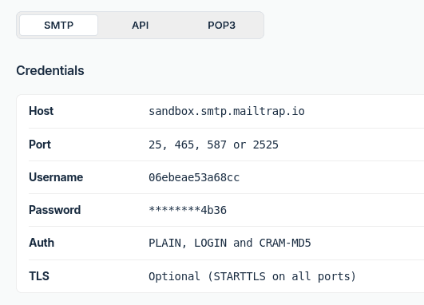

We are now adding the function that participants who have registered for a course will receive a registration confirmation and a request for payment by e-mail.

## Sending e-mails with SeaTable

To send e-mails with SeaTable, you must first create an e-mail account in the Base. As the configuration differs depending on the provider, we recommend using [mailtrap](https://mailtrap.io). _Mailtrap_ allows you to send emails to a virtual mailbox, which has the advantage that no emails are sent to real or fictitious customers - but you can simulate sending emails realistically.



### Create a Mailtrap account

To get started, visit the [Mailtrap registration page](https://mailtrap.io/register/signup) and create a free account.

Confirm your e-mail address and log in. After answering a few questions about your interests - these are not relevant for the rest of the process - you will be taken to the _Mailtrap_ homepage.

In the left-hand menu, click on `E-Mail Testing > Inboxes`. There you will already find a preconfigured inbox with the name `My Inbox`. You will need the corresponding SMTP access data for the configuration in SeaTable.

### Configure e-mail dispatch in SeaTable

With the SMTP access data from Mailtrap, you can now set up [e-mail dispatch in SeaTable](https://seatable.io/en/docs/arbeiten-mit-bases/einrichtung-eines-e-mail-kontos-in-einer-base/).

The emails are not actually sent, but appear in your Mailtrap mailbox. Test this by sending an e-mail to any recipient - it will only end up in your virtual mailbox.

## Send e-mail to the customer

Now we can see in the table `Registrations` to create a new column for sending e-mails. Use the following settings:

> Name: any  
> Column type: ` Button`  
> Label: `Send`  
> Action: ` Send email`  
> Subject: `Confirmation: Course {Registered for}`  
> Recipient: `customer@example.com`

You can use the following text template for the message text:

> Hey,  
> Thank you for registering for the course {Registered for} on {Date}.
>
> To complete your registration, please transfer the course fee using the details below:
>
> Amount: {Price}  
> Bank: Example Bank LTD  
> IBAN: XYZ
>
> We appreciate your prompt payment!
>
> Best regards

In the simple text editor, the placeholders in curly brackets are replaced automatically. If you are using the rich text editor, you must replace the placeholders manually using the ` Insert column` insert.

Then click on the button and check whether the e-mail appears in your Mailtrap mailbox.

Congratulations! You have just sent your first email via SeaTable - even if it only went to Mailtrap's virtual mailbox.



## Help article with further information

- [Setting up an e-mail account in a base](https://seatable.io/en/docs/arbeiten-mit-bases/einrichtung-eines-e-mail-kontos-in-einer-base/)
- [Set up Gmail to send e-mails via SMTP](https://seatable.io/en/docs/integrationen-innerhalb-von-seatable/gmail-fuer-den-versand-von-e-mails-per-smtp-einrichten/)
- [The button]()
- [Sending an e-mail with a button]()
- [E-mail via automation]()
