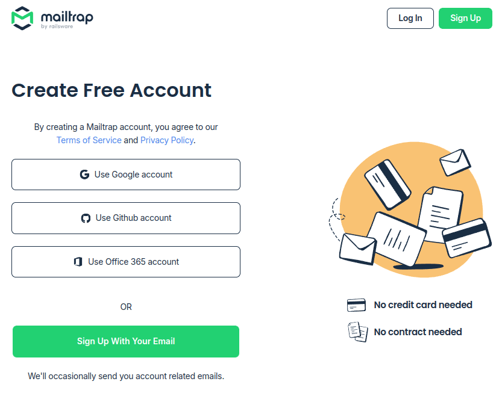
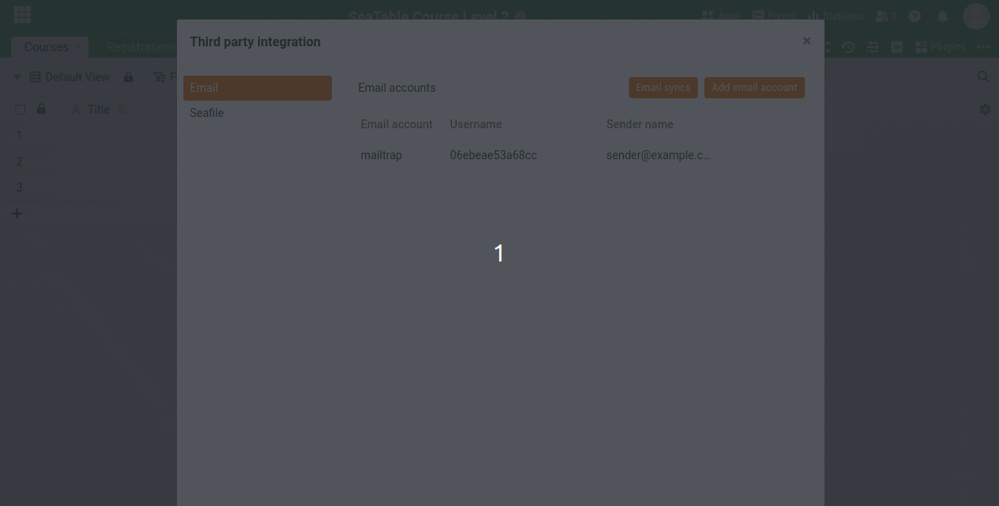
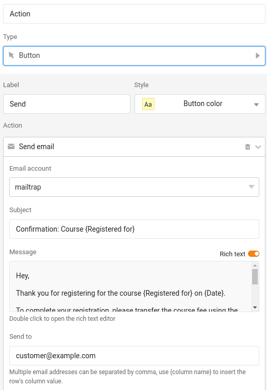

Ahora estamos añadiendo la función de que los participantes que se hayan inscrito en un curso reciban una confirmación de inscripción y una solicitud de pago por correo electrónico.

## Enviar correos electrónicos con SeaTable

Para enviar correos electrónicos con SeaTable, primero debe crear una cuenta de correo electrónico en la base. Como la configuración difiere según el proveedor, recomendamos utilizar [mailtrap](https://mailtrap.io). _Mailtrap_ le permite enviar correos electrónicos a un buzón virtual, que tiene la ventaja de que no se envían correos electrónicos a clientes reales o ficticios - pero se puede simular el envío de correos electrónicos de forma realista.



### Crear una cuenta Mailtrap

Para empezar, visite la [página de registro de Mailtrap](https://mailtrap.io/register/signup) y cree una cuenta gratuita.

Confirma tu dirección de correo electrónico e inicia sesión. Tras responder a algunas preguntas sobre sus intereses -que no son relevantes para el resto del proceso-, accederá a la página de inicio _de Mailtrap_.

En el menú de la izquierda, haga clic en `E-Mail Testing > Inboxes`. Allí encontrará ya una bandeja de entrada preconfigurada con el nombre `My Inbox`. Necesitará los datos de acceso SMTP correspondientes para la configuración en SeaTable.

### Configurar el envío de correo electrónico en SeaTable

Con los datos de acceso SMTP de Mailtrap, ahora puede configurar [el envío de correo electrónico en SeaTable](https://seatable.io/es/docs/arbeiten-mit-bases/einrichtung-eines-e-mail-kontos-in-einer-base/).

Los correos electrónicos no se envían realmente, sino que aparecen en su buzón de Mailtrap. Pruébelo enviando un correo electrónico a cualquier destinatario: sólo aparecerá en su buzón virtual.

## Enviar correo electrónico al cliente

Ahora podemos ver en la tabla `Registrations` para crear una nueva columna para enviar correos electrónicos. Utilice la siguiente configuración:

> Nombre: any
>
> Tipo de columna: ` Button`
>
> Etiqueta: `Send`
>
> Acción: ` Send email`
>
> Asunto: `Confirmation: Course {Registered for}`
>
> Beneficiario: `customer@example.com`

Puede utilizar la siguiente plantilla de texto para el texto del mensaje:

> Hey,  
> Thank you for registering for the course {Registered for} on {Date}.
>
> To complete your registration, please transfer the course fee using the details below:
>
> Amount: {Price}  
> Bank: Example Bank LTD  
> IBAN: XYZ
>
> We appreciate your prompt payment!
>
> Best regards

En el editor de texto simple, los marcadores de posición entre llaves se sustituyen automáticamente. Si utiliza el editor de texto enriquecido, debe reemplazar los marcadores de posición manualmente utilizando la función ` Insert column` insertar.

A continuación, haga clic en el botón y compruebe si el correo electrónico aparece en su buzón Mailtrap.

¡Enhorabuena! Acaba de enviar su primer correo electrónico a través de SeaTable - aunque sólo haya ido al buzón virtual de Mailtrap.



## Artículo de ayuda con más información

- [Crear una cuenta de correo electrónico en una base](https://seatable.io/es/docs/arbeiten-mit-bases/einrichtung-eines-e-mail-kontos-in-einer-base/)
- [Configurar Gmail para enviar correos electrónicos a través de SMTP](https://seatable.io/es/docs/integrationen-innerhalb-von-seatable/gmail-fuer-den-versand-von-e-mails-per-smtp-einrichten/)
- [El botón]()
- [Enviar un correo electrónico mediante un botón]()
- [Correo electrónico automatizado]()
