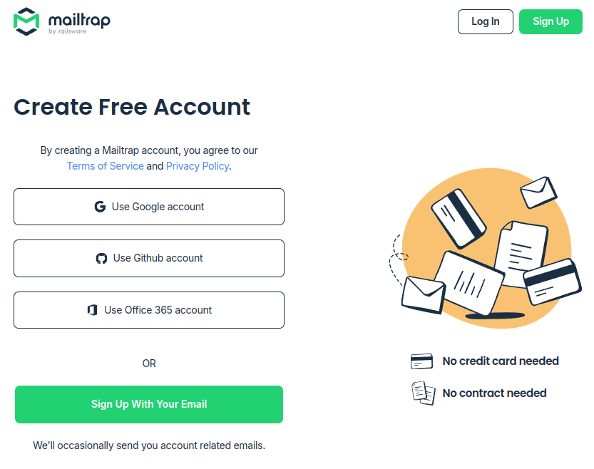
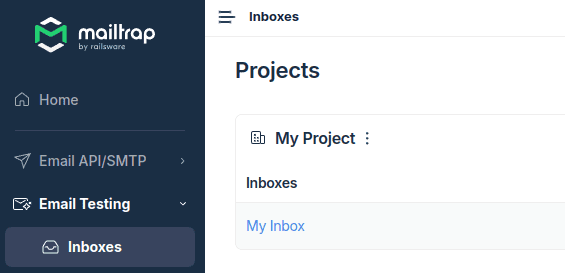
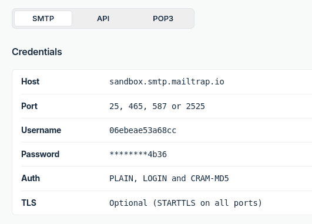
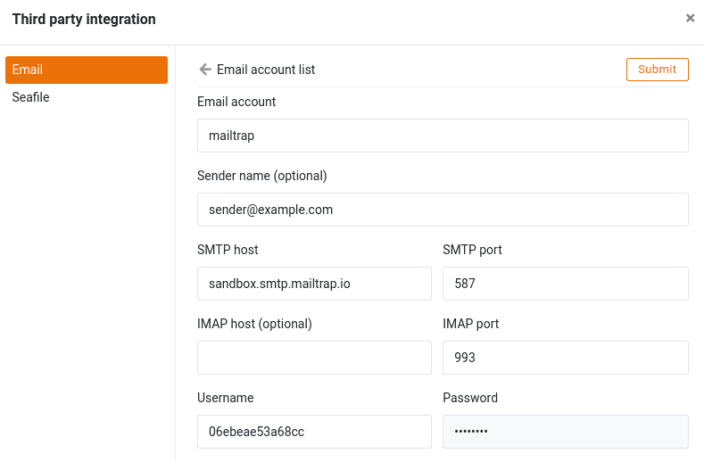
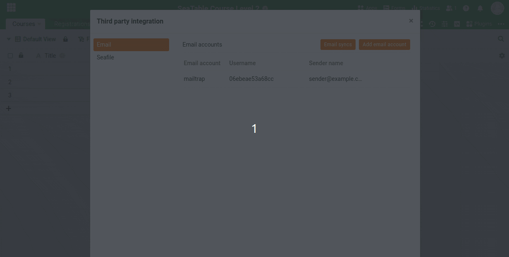
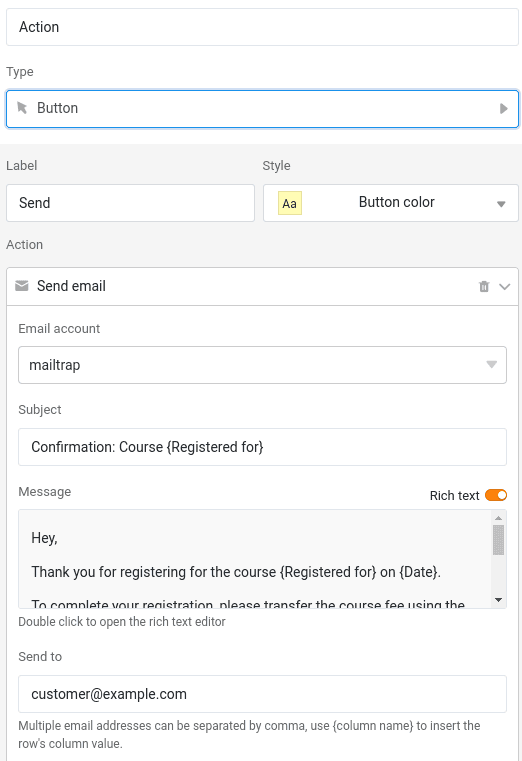
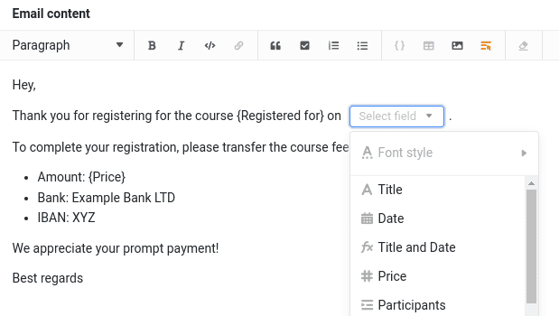

Nous ajoutons maintenant la fonction permettant aux participants qui se sont inscrits à un cours de recevoir une confirmation d'inscription ainsi qu'une demande de paiement par e-mail.

## Envoi d'e-mails avec SeaTable

Pour envoyer des e-mails avec SeaTable, vous devez d'abord enregistrer un compte e-mail dans la base. Comme la configuration varie selon les fournisseurs, nous vous recommandons d'utiliser [mailtrap](https://mailtrap.io). _Mailtrap_ vous permet d'envoyer des e-mails dans une boîte aux lettres virtuelle, ce qui a l'avantage de ne pas envoyer d'e-mails à des clients réels ou fictifs - mais vous pouvez simuler l'envoi d'e-mails de manière réaliste.



### Créer un compte Mailtrap

Pour commencer, visitez la [page d'enregistrement de Mailtrap](https://mailtrap.io/register/signup) et créez un compte gratuit.

Confirmez votre adresse e-mail et connectez-vous. Après quelques questions sur vos intérêts - qui ne sont pas pertinentes pour la suite - vous arrivez sur la page d'accueil de _Mailtrap_.

Dans le menu de gauche, cliquez sur `E-Mail Testing > Inboxes`. Vous y trouverez déjà une boîte de réception préconfigurée nommée `My Inbox`. Vous avez besoin des données d'accès SMTP correspondantes pour la configuration dans SeaTable.

### Configurer l'envoi d'e-mails dans SeaTable

Avec les données d'accès SMTP de Mailtrap, vous pouvez maintenant configurer l'[envoi d'e-mails dans SeaTable](https://seatable.io/fr/docs/arbeiten-mit-bases/einrichtung-eines-e-mail-kontos-in-einer-base/).

Les e-mails ne sont pas réellement envoyés, mais apparaissent dans votre boîte mailtrap. Testez ceci en envoyant un e-mail à n'importe quel destinataire - il atterrira uniquement dans votre boîte aux lettres virtuelle.

## Envoyer un e-mail au client

Maintenant, nous pouvons être dans le tableau `Registrations` créer une nouvelle colonne pour l'envoi d'e-mails. Utilisez les paramètres suivants :

> Nom : au choix  
> Type de colonne : ` Button`  
> Label : `Send`  
> Action : ` Send email`  
> Objet : `Confirmation: Course {Registered for}`  
> Récepteurs : `customer@example.com`

Pour le texte du message, vous pouvez utiliser le modèle de texte suivant :

> Hey,  
> Thank you for registering for the course {Registered for} on {Date}.
>
> To complete your registration, please transfer the course fee using the details below:
>
> Amount: {Price}  
> Bank: Example Bank LTD  
> IBAN: XYZ
>
> We appreciate your prompt payment!
>
> Best regards

Si vous utilisez l'éditeur de texte simple, les caractères de remplacement entre accolades sont remplacés automatiquement. Si vous utilisez l'éditeur de texte enrichi, vous devez remplacer les espaces réservés manuellement en utilisant la fonction ` Insert column` insérer.

Cliquez ensuite sur le bouton et vérifiez si l'e-mail apparaît dans votre boîte aux lettres Mailtrap.

Félicitations ! Vous venez d'envoyer votre premier e-mail via SeaTable - même s'il n'est allé que dans la boîte aux lettres virtuelle de Mailtrap.



## Article d'aide avec plus d'informations

- [Configurer un compte de messagerie dans une base](https://seatable.io/fr/docs/arbeiten-mit-bases/einrichtung-eines-e-mail-kontos-in-einer-base/)
- [Configurer Gmail pour l'envoi d'e-mails via SMTP](https://seatable.io/fr/docs/integrationen-innerhalb-von-seatable/gmail-fuer-den-versand-von-e-mails-per-smtp-einrichten/)
- [Le bouton]()
- [Envoyer un e-mail via un bouton]()
- [E-mail par automatisation]()
