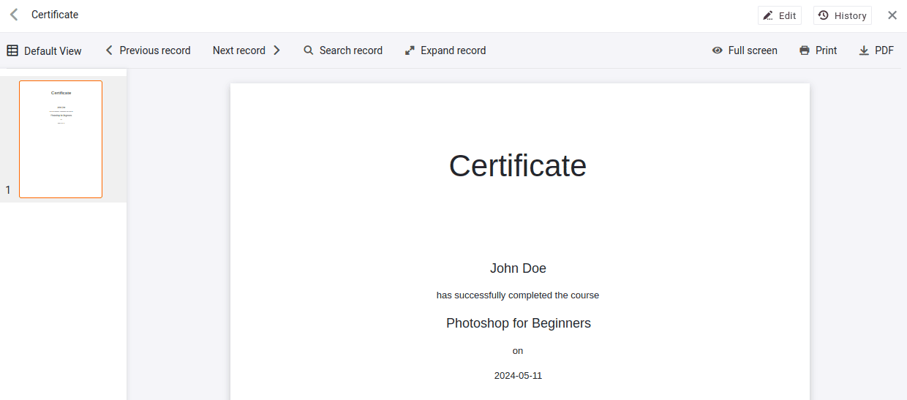

Depois de concluir o seu serviço, pretende concluir o processo enviando uma mensagem de correio eletrónico final aos participantes. Este correio eletrónico pode ter vários conteúdos, tais como

- Uma confirmação de participação
- Obrigado pela vossa participação
- Um pedido de feedback
- Um código de voucher para o próximo curso
- ...

## Criar e enviar a confirmação de participação

Nesta secção, utilizaremos o SeaTable para gerar uma confirmação de participação em PDF e enviá-la aos participantes por correio eletrónico.

### Fusão de correio com o plugin de conceção de páginas

O SeaTable oferece vários plug-ins que lhe permitem acrescentar visualizações e funções adicionais aos seus dados. O plugin de design de página permite-lhe criar documentos PDF - semelhante a uma fusão de correio no Microsoft Word.

Com este plugin, pode criar modelos que contêm conteúdo estático (como texto ou logótipos) e dados dinâmicos da sua base. Cada linha da tabela pode gerar um documento individual.



Já preparámos um modelo simples para este curso, para criar uma confirmação de participação. O nome, o curso e a data do curso são inseridos automaticamente, enquanto o resto do texto permanece inalterado.

Dedique alguns minutos a explorar as possibilidades do plug-in. Por exemplo, experimente adicionar um logótipo ou um gráfico à sua assinatura.

Se clicar em ` PDF` o PDF gerado será guardado no seu PC.



### Envio por correio eletrónico

É claro que não quer descarregar o PDF manualmente e carregá-lo novamente para o enviar por correio eletrónico. Em vez disso, pode clicar num botão no menu `Registrations` que executa duas acções em sucessão:

- ` Create PDF and save to column`
- ` Send email`

A configuração destas acções já deve ser familiar. Ao criar o PDF, selecione o modelo pretendido e a coluna na qual o documento deve ser guardado. Ao enviar o e-mail, especifique a coluna a partir da qual o anexo deve ser enviado.



### Algumas palavras sobre a gestão de ficheiros

No SeaTable, os ficheiros e as imagens não são armazenados diretamente nas células, mas no armazenamento central de dados da base. As células contêm apenas ligações para os respectivos ficheiros. Esta gestão centralizada tem várias vantagens:

- Os ficheiros podem ser utilizados várias vezes sem ter de os carregar novamente.
- Mesmo que se elimine um ficheiro de uma célula, este continua disponível na administração central até ser eliminado definitivamente.

Dedique alguns minutos para se familiarizar com a gestão de ficheiros do SeaTable. Para mais informações, consulte os artigos de ajuda no final desta secção.

## Artigo de ajuda com mais informações

- [Instruções para o plugin de conceção de páginas](https://seatable.io/pt/docs/seitendesign-plugin/anleitung-zum-seitendesign-plugin/)
- [Guardar um documento PDF por botão numa coluna](https://seatable.io/pt/docs/andere-spalten/ein-pdf-dokument-per-schaltflaeche-in-einer-spalte-speichern/)
- [A coluna do ficheiro](https://seatable.io/pt/docs/dateien-und-bilder/die-datei-spalte/)
- [A gestão de ficheiros de uma base](https://seatable.io/pt/docs/dateien-und-bilder/das-dateimanagement-einer-base/)
