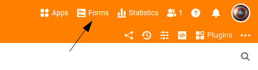
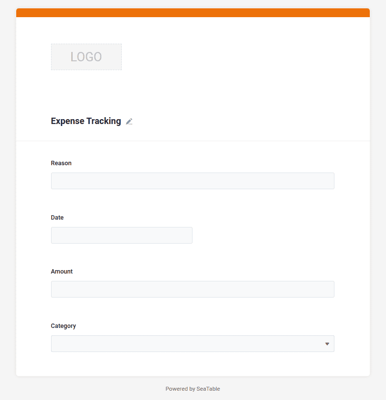

Теперь, когда мы создали необходимую структуру для управления расходами в шаге 1, вы можете вводить новые расходы в любое время с помощью браузера. Вы, наверное, помните: Каждая строка представляет собой новую запись данных, а в вашем случае - платежную операцию.

Но, конечно, было бы неплохо, если бы вы могли записывать и другие расходы на свой мобильный телефон, находясь в пути. Или вы хотите записывать расходы коллег по команде или членов семьи. Для этих случаев идеально подходит веб-форма, которую вы можете легко создать с помощью SeaTable, поскольку вы уже определили возможности формы ввода с помощью типов столбцов. Но что я должен долго объяснять? Давайте просто создадим форму, а затем попробуем ее в действии.

## Прикрепление веб-формы

В области заголовка базы вы найдете множество дополнительных функций. За кнопкой `Forms` SeaTable предлагает вам возможность создавать новые веб-формы.

1. Создайте новую веб-форму с именем `Expense Tracking`. Название не имеет особого значения, но почему бы не дать форме красивое имя?
2. Откроется новый пользовательский интерфейс, в котором вы можете создать веб-форму.
3. Перетащите все четыре поля таблицы `Reason`, `Date`, `Amount` и `Category` перетаскиванием в форму.

## Дополнительные настройки веб-формы

Ваша веб-форма почти готова, и ее уже можно использовать. Тем не менее, есть еще три настройки, которые я бы рекомендовал выполнить. Чтобы настроить параметры поля ввода, вам нужно щелкнуть на нем в форме, после чего в правой части формы появятся параметры настройки этого поля ввода. Параметры настройки зависят от того, на какое поле ввода вы нажимаете.

- `Category`: Отдельные варианты должны быть **Список** отображаться
- `Date`: Текущий день уже должен быть **Значение по умолчанию** быть установленным
- `Amount`: Ввод этого поля обязателен **требуется**

Настройка веб-формы завершена, и теперь мы можем использовать ее для ввода первых записей данных.

## Пробуем веб-форму

Используйте оранжевые кнопки в правом верхнем углу, чтобы получить URL-адрес веб-формы или QR-код.

Вы увидите, что при отправке формы в базу сразу же записывается новая запись данных. Вам не нужно перезагружать страницу в браузере.

Поэкспериментируйте с веб-формой в течение нескольких минут и насладитесь прогрессом, которого вы только что достигли: **С этого момента вы и любой другой человек, с которым вы поделитесь ссылкой на эту веб-форму, сможет создавать новые записи в вашей базе.**

Важно отметить, что через веб-форму можно создавать только новые записи, а существующие записи нельзя редактировать или просматривать.

Потратьте несколько минут, чтобы изучить дополнительные возможности веб-формы.

## Справочная статья с дополнительной информацией

- [Веб-формы в целом](https://seatable.io/ru/docs/webformulare/webformulare/)
- [Создайте веб-форму](https://seatable.io/ru/docs/webformulare/anlegen-eines-webformulars/)
- [Параметры конфигурации веб-формы](https://seatable.io/ru/docs/webformulare/konfigurationsmoeglichkeiten-eines-webformulars/)
