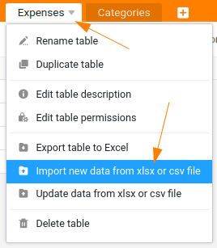

Wahrscheinlich haben Sie jetzt bereits ein paar Ausgaben in Ihrer neuen Ausgabenverwaltung erfasst. Für die folgenden Schritte benötigen wir jedoch ein paar mehr Daten. Deshalb werden wir ihre bisherigen Einträge entfernen und neue Datensätze in die Tabelle importieren.

## Löschen der alten Datensätze

Wechseln Sie zu Ihrer Tabelle `Expenses` und löschen Sie alle bisher erfassten Zeilen. Ihre Tabelle sollte nun leer ein.

## Import von neuen Datensätzen

SeaTable bietet vielfältige Importmöglichkeiten. So können Sie ganze Bases per .dtable, .csv oder .xlsx Datei importieren. Aber auch wenn Sie bereits eine Base haben, können Sie neue oder aktualisierte Daten direkt in eine Tabelle schreiben. Genau das wollen wir jetzt mithilfe einer CSV-Datei tun. Alternativ hätten wir auch hier eine Excel-Datei verwenden können.

- Laden Sie folgende Datei [expenses.csv](https://seatable.io/wp-content/uploads/2024/08/expenses.csv) herunter
- Importieren Sie nun die CSV-Datei in die Tabelle `Expenses`
- Kontrollieren Sie, dass die Tabelle nun genau 50 Einträge hat

## Import und Export

Selbstverständlich können Sie in SeaTable genauso Daten, Tabellen und Bases exportieren, wie Sie diese importieren können. Spielen Sie doch einfach etwas mit den verschiedenen Möglichkeiten, um ein Gefühl für diese Funktionen zu bekommen. Für den weiteren Verlauf dieses Kurses spielt der Export jedoch keine Rolle.

Das war es auch schon für diesen Teil. Auf geht es zum nächsten Schritt.

## Hilfeartikel mit weiteren Informationen

- [Löschen von Zeilen](https://seatable.io/docs/arbeiten-mit-zeilen/das-loeschen-von-zeilen/)
- [Datenimport und Export in SeaTable](https://seatable.io/docs/import-von-daten/datenimport-und-export/)
- [Welche Importformate unterstützt SeaTable?](https://seatable.io/docs/import-von-daten/welche-import-formate-unterstuetzt-seatable/)
