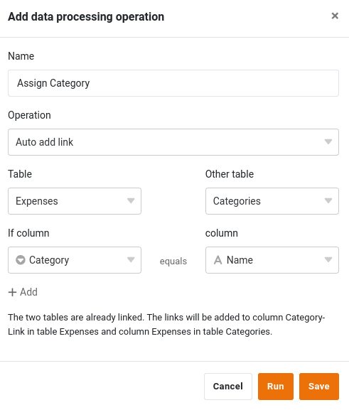

Multiple tables can be linked in SeaTable using link columns. Below we will add a second table with expense categories and link the two tables together to demonstrate this powerful feature.

## Excursus: Advantages of the option to link data records

The linking of data records is one of the central functions of SeaTable, which clearly sets it apart from conventional spreadsheets and gives it the performance of a relational database. This sounds complex, but it is not, as you will soon find out for yourself. Here are the three most important advantages of linked data:

- **More overview**: By linking tables, you create a clear and concise structure. Instead of storing all information in a single table and risking redundancies, you can manage related data - such as expenses and categories - in separate tables. This keeps your data consistent and avoids duplicate entries.
- **More flexible data analysis**: With linked tables, you can combine and evaluate data from different sources in a targeted manner. For example, you can quickly and easily analyze all expenditure in a specific category or department.
- **Easier data maintenance**: changes in a central table are automatically applied to all linked tables. This ensures that your data is always up-to-date and consistent without you having to maintain it multiple times.

## Extending the base structure

In order to be able to create links at all, we need a second table, which we will now create.

1. Create a second table with the name `Categories` in the same base.
2. The table `Categories` requires only one column: `Name`. This is created by default, so you do not need to do anything here.
3. Manually add four entries to the table `Categories` in:

    - `Travel`
    - `Clothing`
    - `Groceries`
    - `Leisure`

    

4. Switch back to the table `Expenses`.

5. Insert another column. Give the new column the name `Category-Link` and select the column type ` Link to other records` off. The column links to the table `Categories`.  
   

## Linking rows between the two tables

You now have two options for linking the data records in both tables:

1. You can assign an entry in the `Expenses` Manually a row from the table `Categories` in which you click on the  and then select the appropriate category. This quickly becomes tedious and error-prone with large amounts of data.  
   
2. Alternatively, you can use the [Data processing options](https://seatable.io/en/docs/datenverarbeitung/datenverarbeitungsoperationen-in-seatable/) of SeaTable to automate the setting of the links.  
   

### Link cells by data processing operation

To do this, create a new data processing operation with the name `Assign Category` and select the operation type `Auto add link` from.

You must also make the following settings so that SeaTable knows how you want to link your data:

- Table: `Expenses`
- Other table: `Categories`
- If column: ` Category`
- Column: ` Name`

Click on Execute to carry out the operation. You will see that all rows in the table `Expenses` with a row from the table `Categories` were linked.



## Remove the unnecessary column

Once all the entries have been linked, you can edit the `Category` in the table `Expenses` delete. Duplicate information is superfluous and should be avoided.

## Revision of the web form

If you now call up your web form for entering expenses again, you will notice that the expense type is no longer requested. Why is this the case?  
By deleting the column `Category` the input option in the web form is automatically removed, as SeaTable no longer has a corresponding column for saving the data.

What do we learn from this? With great power comes great responsibility. In SeaTable, you can add or remove columns in seconds. Most adjustments to a column are harmless. However, if you delete columns or change their type, you should briefly check whether this affects other components.

Try the newly added column `Category-Link` to the web form so that you can enter your expenses as usual. I'm sure you can manage that.

## Help article with further information

- [Add a table to a base](https://seatable.io/en/docs/arbeiten-in-tabellen/eine-tabelle-in-einer-base-hinzufuegen/)
- [How to link tables in SeaTable](https://seatable.io/en/docs/verknuepfungen/wie-man-tabellen-in-seatable-miteinander-verknuepft/)
- [Data processing Compare and link](https://seatable.io/en/docs/datenverarbeitung/datenverarbeitung-vergleichen-und-verknuepfen/)
