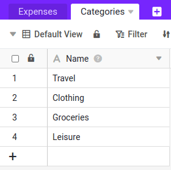
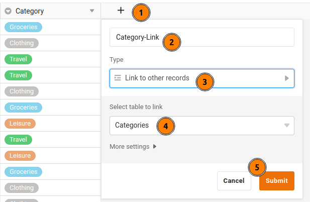
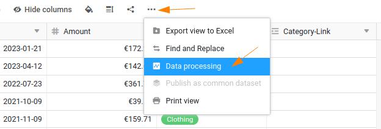
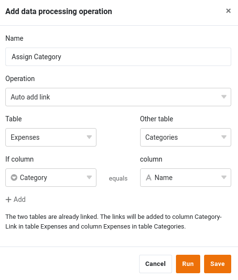

É possível ligar várias tabelas no SeaTable utilizando colunas de ligação. De seguida, adicionaremos uma segunda tabela com categorias de despesas e ligaremos as duas tabelas para demonstrar esta poderosa funcionalidade.

## Excurso: Vantagens da opção de ligar registos de dados

A ligação de registos de dados é uma das funções centrais do SeaTable, que o distingue claramente das folhas de cálculo convencionais e lhe confere o desempenho de uma base de dados relacional. Isto parece complexo, mas não é, como em breve descobrirá por si próprio. Eis as três vantagens mais importantes dos dados ligados:

- **Mais síntese**: Ao ligar tabelas, cria uma estrutura clara e organizada. Em vez de armazenar todas as informações numa única tabela e correr o risco de redundâncias, pode gerir dados relacionados - como despesas e categorias - em tabelas separadas. Isto mantém os seus dados consistentes e evita entradas duplicadas.
- **Análise de dados mais flexível**: Com as tabelas ligadas, pode combinar e analisar dados de diferentes fontes de uma forma direcionada. Por exemplo, pode analisar rápida e facilmente todas as despesas de uma categoria ou departamento específico.
- **Manutenção de dados mais fácil**: As alterações numa tabela central são automaticamente aplicadas a todas as tabelas ligadas. Isto garante que os seus dados estão sempre actualizados e consistentes sem que tenha de os atualizar várias vezes.

## Alargamento da estrutura de base

Para podermos criar ligações, precisamos de uma segunda tabela, que vamos criar agora.

1. Criar uma segunda tabela com o nome `Categories` na mesma base.
2. A mesa `Categories` requer apenas uma coluna: `Name`. Este é criado por defeito, pelo que não é necessário fazer nada aqui.
3. Adicionar manualmente quatro entradas à tabela `Categories` em:

    - `Travel`
    - `Clothing`
    - `Groceries`
    - `Leisure`

    

4. Voltar à mesa `Expenses`.

5. Insira outra coluna. Dar à nova coluna o nome `Category-Link` e selecionar o tipo de coluna ` Link to other records` desligado. A coluna liga ao quadro `Categories`.  
   

## Ligação de linhas entre as duas tabelas

Existem agora duas opções para ligar os registos de dados em ambas as tabelas:

1. É possível atribuir uma entrada na lista `Expenses` Selecionar manualmente uma linha da tabela `Categories` clicando na célula do ficheiro  e, em seguida, selecionar a categoria adequada. Isto torna-se rapidamente aborrecido e propenso a erros com grandes quantidades de dados.  
   
2. Em alternativa, pode utilizar o [Opções de processamento de dados](https://seatable.io/pt/docs/datenverarbeitung/datenverarbeitungsoperationen-in-seatable/) do SeaTable para automatizar a definição das ligações.  
   

### Ligar células por operação de processamento de dados

Para isso, criar uma nova operação de processamento de dados com o nome `Assign Category` e selecionar o tipo de operação `Auto add link` de.

Também é necessário efetuar as seguintes definições para que o SeaTable saiba como pretende ligar os seus dados:

- Tabela: `Expenses`
- Outra mesa: `Categories`
- Se coluna: ` Category`
- Coluna: ` Name`

Clique em Executar para efetuar a operação. Verá que todas as linhas da tabela `Expenses` com uma linha do quadro `Categories` estavam ligados.



## Remover a coluna desnecessária

Depois de todas as entradas terem sido ligadas, pode editar o `Category` no quadro `Expenses` eliminar. A duplicação de informações é supérflua e deve ser evitada.

## Revisão do formulário Web

Se voltar a abrir o formulário Web para introduzir despesas, verificará que o tipo de despesas já não é solicitado. Porque é que isto acontece?  
Ao eliminar a coluna `Category` a opção de introdução no formulário Web é automaticamente cancelada, uma vez que o SeaTable já não dispõe de uma coluna correspondente para guardar os dados.

O que é que aprendemos com isto? Com grande poder vem grande responsabilidade. No SeaTable, é possível adicionar ou remover colunas em segundos. A maioria dos ajustes a uma coluna são inofensivos. No entanto, se eliminar colunas ou alterar o seu tipo, deve verificar brevemente se isso afecta outros componentes.

Porque não experimenta a coluna recentemente adicionada `Category-Link` para o formulário Web, para que possa introduzir as suas despesas como habitualmente. Tenho a certeza de que o conseguirá fazer.

## Artigo de ajuda com mais informações

- [Adicionar uma tabela a uma base](https://seatable.io/pt/docs/arbeiten-in-tabellen/eine-tabelle-in-einer-base-hinzufuegen/)
- [Como ligar as tabelas em SeaTable](https://seatable.io/pt/docs/verknuepfungen/wie-man-tabellen-in-seatable-miteinander-verknuepft/)
- [Processamento de dados Comparar e ligar](https://seatable.io/pt/docs/datenverarbeitung/datenverarbeitung-vergleichen-und-verknuepfen/)
