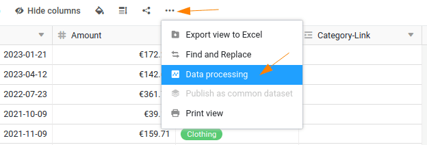

В SeaTable можно связать несколько таблиц с помощью столбцов ссылок. Ниже мы добавим вторую таблицу с категориями расходов и свяжем обе таблицы вместе, чтобы продемонстрировать эту мощную функцию.

## Экскурс: Преимущества возможности связывать записи данных

Связывание записей данных - одна из центральных функций SeaTable, которая явно отличает ее от обычных электронных таблиц и придает ей характеристики реляционной базы данных. Звучит сложно, но это не так, в чем вы вскоре убедитесь сами. Вот три наиболее важных преимущества связанных данных:

- **Больше обзора**: связывая таблицы, вы создаете четкую и организованную структуру. Вместо того чтобы хранить всю информацию в одной таблице и рисковать избыточностью, вы можете управлять связанными данными - например, расходами и категориями - в отдельных таблицах. Это позволяет сохранить последовательность данных и избежать дублирования записей.
- **Более гибкий анализ данных**: с помощью связанных таблиц вы можете объединять и целенаправленно анализировать данные из разных источников. Например, вы можете быстро и легко проанализировать все расходы в определенной категории или отделе.
- **Более простое обслуживание данных**: изменения в центральной таблице автоматически применяются ко всем связанным таблицам. Благодаря этому данные всегда актуальны и непротиворечивы, и вам не придется многократно их обновлять.

## Расширение базовой структуры

Для того чтобы вообще иметь возможность создавать ссылки, нам нужна вторая таблица, которую мы сейчас и создадим.

1. Создайте вторую таблицу с именем `Categories` на той же базе.
2. Стол `Categories` требуется только одна колонка: `Name`. Он создается по умолчанию, поэтому вам не нужно ничего делать.
3. Вручную добавьте четыре записи в таблицу `Categories` в:

    - `Travel`
    - `Clothing`
    - `Groceries`
    - `Leisure`

    

4. Переключитесь обратно на стол `Expenses`.

5. Вставьте еще один столбец. Дайте новому столбцу имя `Category-Link` и выберите тип столбца ` Link to other records` выключено. Колонка ссылается на таблицу `Categories`.  
   

## Связывание строк между двумя таблицами

Теперь у вас есть две возможности связать записи данных в обеих таблицах:

1. Вы можете назначить запись в `Expenses` Выберите строку из таблицы вручную `Categories` щелкнув в ячейке на  а затем выберите соответствующую категорию. Это быстро становится утомительным и приводит к ошибкам при работе с большими объемами данных.  
   
2. В качестве альтернативы вы можете использовать [Варианты обработки данных](https://seatable.io/ru/docs/datenverarbeitung/datenverarbeitungsoperationen-in-seatable/) SeaTable для автоматизации установки связей.  
   

### Связывание ячеек с помощью операции обработки данных

Для этого создайте новую операцию обработки данных с именем `Assign Category` и выберите тип операции `Auto add link` от.

Вы также должны выполнить следующие настройки, чтобы SeaTable знал, как вы хотите связать свои данные:

- Таблица: `Expenses`
- Другой стол: `Categories`
- Если колонка: ` Category`
- Колонна: ` Name`

Нажмите на кнопку Выполнить, чтобы выполнить операцию. Вы увидите, что все строки в таблице `Expenses` со строкой из таблицы `Categories` были связаны.



## Удалите ненужный столбец

После того как все записи будут связаны, вы можете отредактировать `Category` в таблице `Expenses` Удалить. Дублирование информации является излишним и должно быть исключено.

## Пересмотр веб-формы

Если теперь вы снова вызовете веб-форму для ввода расходов, вы заметите, что тип расходов больше не запрашивается. Почему так происходит?  
Удалив колонку `Category` опция ввода в веб-форме автоматически отменяется, поскольку в SeaTable больше нет соответствующего столбца для сохранения данных.

Чему мы научились? С большой силой приходит большая ответственность. В SeaTable вы можете добавлять или удалять столбцы за считанные секунды. Большинство изменений в столбцах безвредны. Однако если вы удаляете столбцы или меняете их тип, вам следует внимательно проверить, не повлияет ли это на другие компоненты.

Почему бы вам не попробовать недавно добавленную колонку `Category-Link` в веб-форму, чтобы вы могли вводить свои расходы как обычно. Я уверен, что вы справитесь с этим.

## Справочная статья с дополнительной информацией

- [Добавить таблицу в базу](https://seatable.io/ru/docs/arbeiten-in-tabellen/eine-tabelle-in-einer-base-hinzufuegen/)
- [Как связать таблицы вместе в SeaTable](https://seatable.io/ru/docs/verknuepfungen/wie-man-tabellen-in-seatable-miteinander-verknuepft/)
- [Обработка данных Сравнение и связь](https://seatable.io/ru/docs/datenverarbeitung/datenverarbeitung-vergleichen-und-verknuepfen/)
