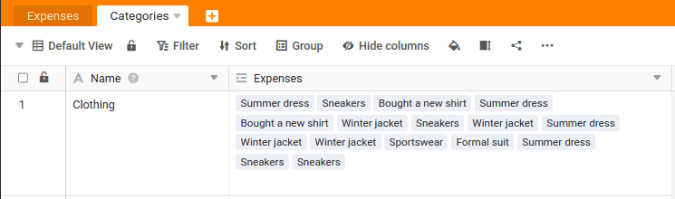
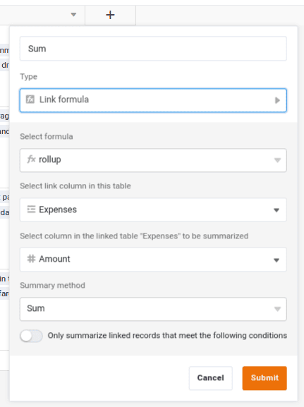

Ahora hemos vinculado los registros de datos de ambas tablas. Es importante que este enlace no sea unilateral. Si enlaza la tabla `Categories` verá que también se ha añadido una nueva columna que muestra los enlaces. En nuestro caso, esto significa que una incidencia está vinculada a una categoría, y que una categoría puede estar vinculada a muchas incidencias.

Todavía no hemos obtenido ningún beneficio directo de los enlaces, pero esto está a punto de cambiar: Con la ayuda de los enlaces, podemos crear análisis estadísticos en cuestión de segundos. Por ejemplo, podemos determinar fácilmente a cuánto asciende la suma de todos los gastos de la categoría `Travel` es.

## Aumentar la altura de la línea

En primer lugar, aumente la altura de la fila en la tabla `Categories` para ver más enlaces. Encontrará la opción correspondiente `` en la fila situada sobre el nombre de la columna. También puede arrastrar columnas individuales para ver más contenido.

## Análisis de las categorías

Ahora cree una nueva columna en la tabla `Categories` a.

> Nombre: `Sum`  
> Tipo de columna: ` Link formula`  
> Fórmula utilizada: `rollup`  
> Columna de enlace utilizada: `Expenses`  
> Columna utilizada para el cálculo: ` Amount`  
> Método de cálculo `Sum`

A continuación, puede cambiar el formato de la columna `Sum` a euros para que los totales mostrados tengan el formato correspondiente en euros.

## Cálculo automático con cada cambio

¿No es fantástico? En la columna `Sum` los gastos totales de cada categoría se muestran siempre automáticamente. Aunque haga clic en otros gastos de la `Expenses` el total se actualiza inmediatamente.

Por supuesto, eso no es todo. Puede limitar el análisis a años concretos o añadir condiciones adicionales. A medida que adquiera más experiencia con SeaTable, podrá crear este tipo de análisis con sólo unos clics.

Esto nos lleva al final de esta sección. Desplázate hasta el final y pasa al sexto y penúltimo tema de este curso online.



## Artículo de ayuda con más información

- [Ajustar la altura de la fila](https://seatable.io/docs/ansichtsoptionen/zeilenhoehe-anpassen/)
- [La fórmula del roll-up](https://seatable.io/docs/verknuepfungen/die-rollup-formel/)
