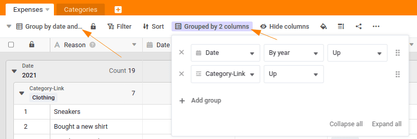

You have created a solid spend management system that already automatically calculates the total spend per category. Now you will get to know another SeaTable function: **the views**.

Views allow you to use filters, sorting, grouping and hiding information to determine which data is displayed in a table. Views always apply per table and you can create as many views as you like. This means you always receive the information that is relevant to you.

For example, you could create a view that only shows expenses over 100 euros and sorts them by date. This allows you to keep track of larger expenses.



## Create an additional view with a grouping

Switch to the table `Expenses` and create a new view. Choose a name that clearly indicates the purpose of the view, such as `Group by date and category`.

Each newly created view does not initially contain any groupings, sorting or filters. We now want to change this:

1. Group the data in the column `Date` by year.
2. Then group the data according to `Category-Link`.

## Create a view with filter and grouping

Now that you have mastered grouping your data, it's time to filter data using a view.

Create a new view with the name `Clothing Expenses by Year`to show the annual expenditure on clothing:

1. Add a filter: `Category-Link` contains `Clothing`to display only the entries in this category.
2. Group the filtered data by year.

Now, with just a few clicks, you have created a view that clearly presents your clothing expenditure, grouped by year.

## Experiment with other views

This concludes this online course, which is also the beginning of your journey with SeaTable. Take a few minutes to experiment with other views - understanding them is one of the most important aspects of using SeaTable.

I encourage you to get to know SeaTable better. You have already created a powerful tool, but there is much more to discover!

When you've experimented enough, try to complete the quiz and earn your award in our community forum.

## Help article with further information

- [What is a view?](https://seatable.io/en/docs/grundlagen-von-ansichten/was-ist-eine-ansicht/)
- [Grouping, sorting and filters](https://seatable.io/en/docs/grundlagen-von-ansichten/gruppierung-sortierung-und-filter/)
- [Create a new view](https://seatable.io/en/docs/grundlagen-von-ansichten/anlegen-einer-neuen-ansicht/)
- [Pin views](https://seatable.io/en/docs/grundlagen-von-ansichten/ansichten-pinnen/)
- [The status bar and its functions](https://seatable.io/en/docs/ansichtsoptionen/die-status-zeile-und-ihre-funktionen/)
