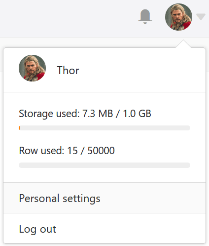

You can customize your own **avatar image** in just a few steps in the **personal settings of** your account.

An avatar image is helpful for other team members to quickly identify you in SeaTable, because the image is also displayed as a thumbnail in [collaborator](https://seatable.io/en/docs/datum-dauer-und-personen/die-spalte-mitarbeiter/), [creator](https://seatable.io/en/docs/datum-dauer-und-personen/die-spalten-ersteller-und-erstellt/), and [last editor columns](https://seatable.io/en/docs/datum-dauer-und-personen/die-spalten-letzter-bearbeiter-und-zuletzt-bearbeitet/), for example, and in front of your name in shares.

## To customize your avatar image

1. Switch to the SeaTable **home** page.
2. Click the **avatar image** in the upper right corner to open the drop-down menu.

4. Click **Personal Settings**.
5. Hover your mouse over the **square** containing your **current avatar image** and click the **pencil icon** that appears .

7. In the "Upload File" window that opens, select a **new image** as the avatar image.


