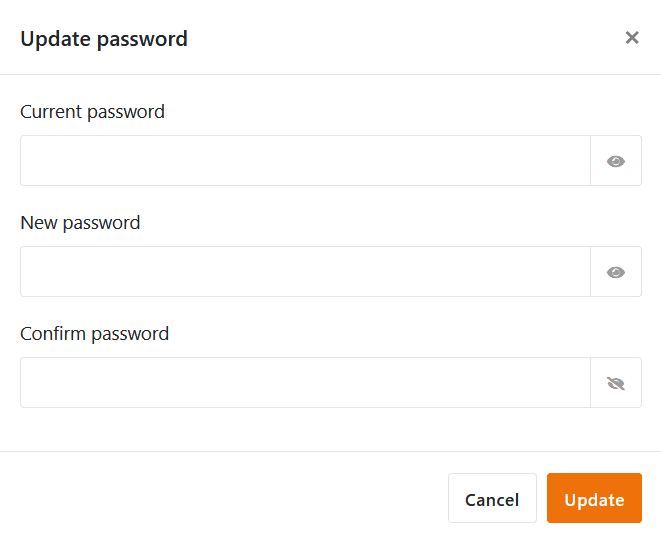

You want to change your own **password**? No problem! In the **personal settings of** your account this is possible in just a few steps.

## To change your password

1. Switch to the SeaTable **home** page.
2. Click your **avatar image** in the upper right corner to open the drop-down menu.

4. Click **Personal Settings**.
5. In the Password section, click **Update**.
6. Fill in the displayed fields:
    - **Current password**
    - **New password**
    - **Confirm password**

To display a password in **plain text**, click on the **eye symbol** to the right of it. You will also automatically see the **strength** of your new password.

10. Confirm the change to your password with **Update**.
