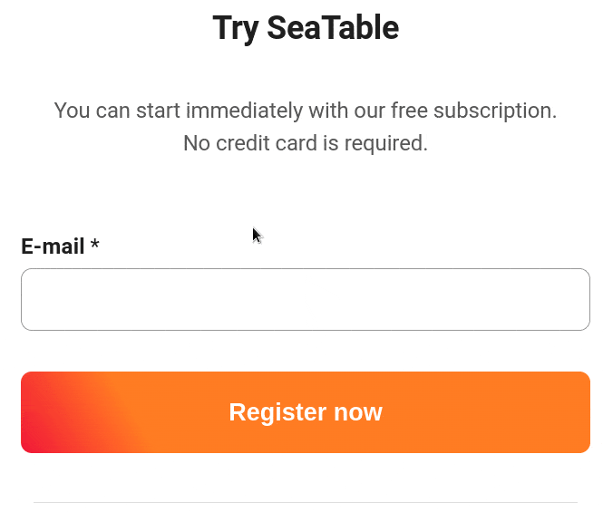

Sie haben keine Bestätigungs-E-Mail für Ihre Registrierung bei SeaTable erhalten? Kein Grund zur Sorge! Befolgen Sie einfach die untenstehenden Schritte und Sie können Ihre Registrierung in Kürze fortsetzen.

## Erfolgreiche Registrierung

Sofern Sie im Zuge Ihrer Registrierung **keine** Fehlermeldung erhalten haben, sollte im Normalfall eine E-Mail zur Bestätigung Ihrer Registrierung an die von Ihnen angegebene E-Mail-Adresse versendet worden sein.

## Mögliche Lösungen

Falls Sie **keine** E-Mail erhalten haben, prüfen Sie bitte folgende Optionen:

1. Haben Sie etwas Geduld: In seltenen Fällen kann sich der Versand der Bestätigungs-E-Mail eine Weile **verzögern**.
2. Prüfen Sie Ihren **Spam-Ordner**, ggf. die Registerkarte **Werbung** und den **Papierkorb**. Vielleicht ist die E-Mail dort gelandet.
3. Falls **keiner** der beiden Schritte zum Erfolg geführt hat, können Sie sich [hier]() erneut mit Ihrer E-Mail-Adresse registrieren und erhalten dann eine **neue** Bestätigungs-E-Mail.
