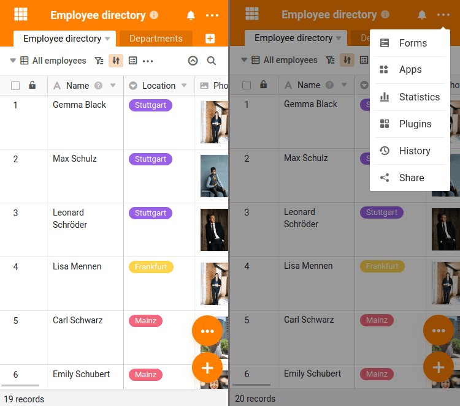
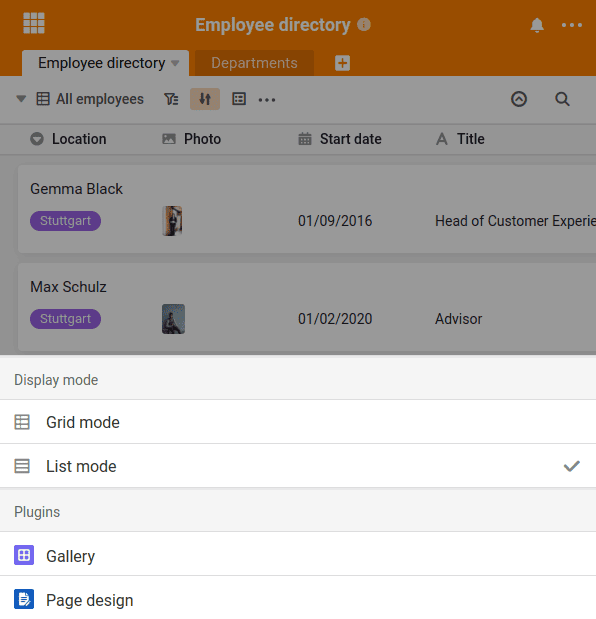

Por supuesto, también puede utilizar SeaTable en **dispositivos móviles** como teléfonos inteligentes y tabletas. Se puede acceder a SeaTable a través del navegador o de la [aplicación para Android, que se encuentra en Google Play Store](https://play.google.com/store/apps/details?id=io.seatable&pli=1). Ya se está planeando una aplicación para iOS, pero aún no hay fecha de lanzamiento.

## Cambios en la interfaz de usuario para resoluciones más pequeñas

Cuando accede a SeaTable a través de un navegador en un dispositivo móvil, la interfaz de usuario de SeaTable cambia para optimizar el funcionamiento para resoluciones de pantalla pequeñas. Los dos cambios más evidentes son los dos grandes botones redondos en la parte inferior derecha de la pantalla.

Sobre la  se pueden crear nuevas entradas y el  puede pasar del conocido modo de lista al modo de cuadrícula. En este modo, cada línea se muestra como un cuadro independiente, lo que facilita su selección.

## Listas de selección en lugar de iconos pequeños

Además, los numerosos botones pequeños que, por lo demás, son familiares en la interfaz web se transforman en listas de selección de generosas dimensiones. Todas las funciones son rápidamente accesibles y pueden manejarse con facilidad incluso en pantallas pequeñas.

## ¿Aplicación o navegador? En cualquier caso, ¡listo para móviles!

El ámbito funcional de SeaTable es idéntico en la app y en el navegador. La app para Android no es una aplicación independiente que se haya reprogramado por completo, sino que solo simplifica el acceso a la nube de SeaTable.

No importa el uso por el que se decida: La presentación de SeaTable, adaptada a pantallas pequeñas, garantiza que también pueda trabajar rápida y fácilmente con SeaTable en dispositivos móviles.
