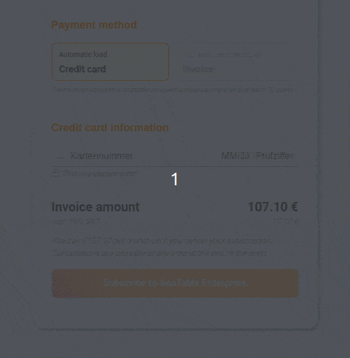

Quando efectua uma subscrição paga do SeaTable, é-lhe normalmente pedido que forneça uma autenticação adicional sob a forma de autenticação 3D Secure, para além de fornecer as informações do seu cartão de crédito. O 3D Secure é uma camada de autenticação adicional para transacções com cartão de crédito que, supostamente, torna os pagamentos na Internet mais seguros. Este mecanismo de segurança causa problemas repetidamente, razão pela qual o pagamento pretendido não pode ser efectuado com êxito e não é possível mudar para o SeaTable Plus ou Enterprise.

## Que problemas podem ocorrer com o 3D Secure?

Normalmente, os pagamentos ao SeaTable são efectuados sem dificuldade. Selecciona a subscrição desejada na administração da equipa, especifica o destinatário da factura e completa a encomenda com os dados do seu cartão de crédito.  
Normalmente, alguns segundos depois, aparece um novo formulário para confirmar a autenticação 3D Secure, que foi recarregada pelo seu banco. Os métodos de confirmação do 3D Secure variam consoante o banco. No entanto, em geral, esta etapa deve ser concluída para que o pagamento ao SeaTable seja autorizado e aceite para pagamentos futuros.

Há sempre problemas com este recarregamento do controlo 3D Secure. Por vezes, este novo formulário não aparece, por vezes o ecrã fica branco e por vezes é acidentalmente clicado.

## O que é que se pode fazer?

Não podemos dar-lhe conselhos gerais porque os problemas são muito variados e dependem sempre do seu browser, do seu sistema operativo e, se aplicável, do software antivírus ou de protecção. Experimente um outro navegador ou um outro cartão de crédito. Esteja atento ao facto de o seu navegador ou sistema operativo lhe poderem dar uma pista sobre a razão pela qual algo não está a acontecer nesse momento.

Basicamente, porém, podemos dizer que a verificação 3D Secure é necessária para concluir uma subscrição paga. Assim, se o pagamento ou a autenticação não funcionarem, basta recarregar a página e tentar novamente.

Se ainda tiver problemas, utilize as [opções de contacto](https://seatable.io/pt/kontakt/) e entre em contacto connosco. Tentaremos ajudá-lo.
