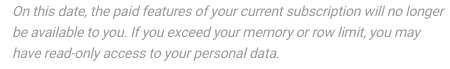

Só tem acesso de leitura aos seus dados e já não os pode editar? Não se preocupe, os seus dados estão seguros. Provavelmente, apenas atingiu os seus **limites**, que estão disponíveis na sua **subscrição** actual **do SeaTable**.



## Como é que posso voltar a editar os meus dados?

Para continuar a editar totalmente os seus dados, tem de **mudar para um pacote de subscrição** que lhe conceda **limites mais alargados** do que os da sua subscrição actual. Pode encontrar os passos necessários em pormenor neste [artigo de ajuda sobre a actualização da sua conta](https://seatable.io/pt/docs/abo-abrechnung/plus-oder-enterprise-abonnement-buchen/).

Em alternativa, pode apagar parte dos seus dados até voltar a ficar abaixo dos seus limites actuais.

## Alteração e limites da subscrição

Tenha também em atenção que **os** seus **limites** também podem ser atingidos se mudar a sua subscrição para um **pacote de subscrição mais pequeno**. Se, depois de mudar de **Enterprise para Plus** ou de **Plus para Free** , o volume dos seus dados exceder os limites incluídos na nova subscrição reservada, poderá ter apenas **acesso de leitura aos** seus dados. Consequentemente, não poderão continuar a processar os seus dados até que volte a mudar para um **pacote de subscrição mais extenso** ou apague parte dos seus dados.

Por conseguinte, **antes de** mudar para um pacote de subscrição inferior, certifique-se de que os seus dados **não** excedem os limites do novo pacote reservado. Receberá também um **aviso** correspondente da SeaTable antes de confirmar uma alteração de subscrição na administração da equipa.

