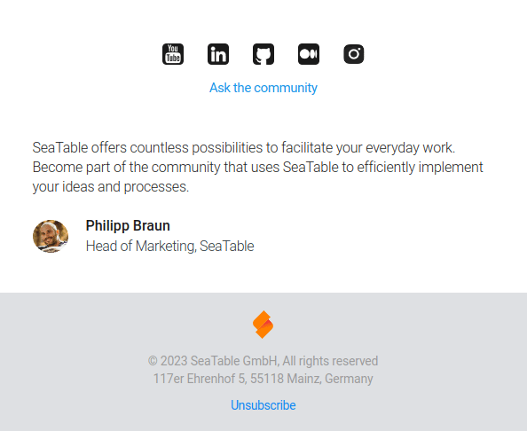

Asegúrate de que sólo recibes los correos electrónicos que son importantes para ti cambiando la configuración de tu suscripción de correo electrónico.

Aquí tiene una lista de los diferentes tipos de correos electrónicos que puede recibir de nosotros:

- **Mensajes del sistema**: Mensajes obligatorios para todos los usuarios de SeaTable Cloud. No se pueden deseleccionar.
- **Actualizaciones del producto**: Contiene información sobre nuevas versiones y actualizaciones del producto SeaTable.
- **Consejos para principiantes**: Ayuda para un buen comienzo con la Nube SeaTable. Estos sólo se envían en la primera semana.
- **Boletín de noticias y eventos**: Correos electrónicos sobre el uso eficiente y las posibilidades concretas de aplicación de SeaTable.

## Para cambiar la configuración de la suscripción por correo electrónico

1. Abra uno de los correos electrónicos de SeaTable descritos anteriormente.
2. Desplácese hasta el final de este correo electrónico.
3. Haga clic en el enlace **para darse de baja**.

5. Realice los cambios deseados en la página que se abre y guárdelos.

