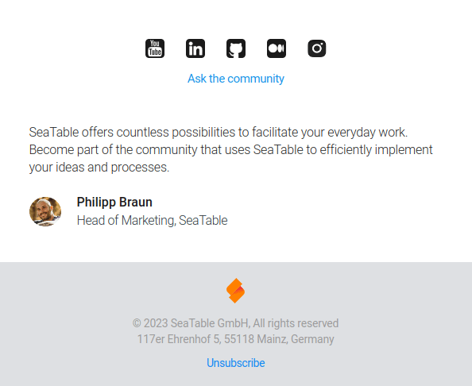
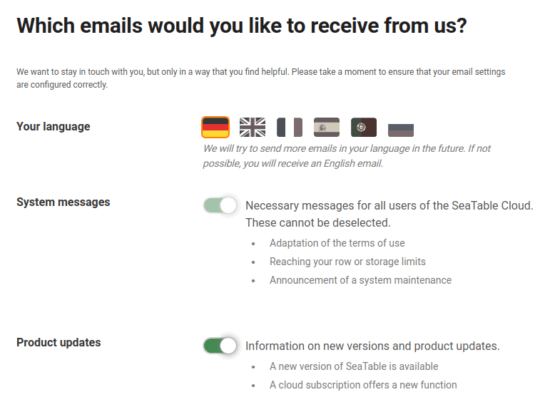

Убедитесь, что вы получаете только важные для вас письма, изменив настройки подписки на электронную почту.

Ниже приведен список различных типов электронных писем, которые вы можете получать от нас:

- **Системные сообщения**: Необходимые сообщения для всех пользователей SeaTable Cloud. Их нельзя отменить.
- **Обновления продукта**: Содержит информацию о новых версиях и обновлениях продукта SeaTable.
- **Советы для новичков**: помощь для хорошего начала работы с SeaTable Cloud. Эти советы рассылаются только в первую неделю.
- **Информационный бюллетень и события**: Электронные письма об эффективном использовании и конкретных возможностях применения SeaTable.

## Чтобы изменить настройки подписки на электронную почту

1. Откройте одно из электронных писем SeaTable, описанных выше.
2. Прокрутите до самого низа этого письма.
3. Нажмите на ссылку " **Отказаться от подписки**".

5. Внесите необходимые изменения на открывшейся странице и сохраните изменения.

