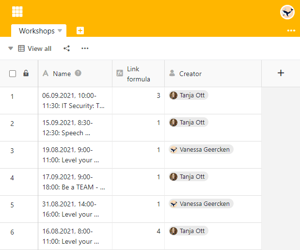

You want to find out **who** added a row ? Then create a column of the type [creator](https://seatable.io/en/docs/datum-dauer-und-personen/die-spalten-ersteller-und-erstellt/). Here the **name of the user** who created the column is unchangeable.

## Create the creator column

1. Add a **new column** using the plus symbol in the table header.
2. Give the column a **name**.
3. Select the **Creator** column type.
4. Click **Submit**.

## Show more row details via columns

In addition, you can use other column types to display _when_ a row was**created** and **last edited** and _who_ changed it as the **last editor**.


