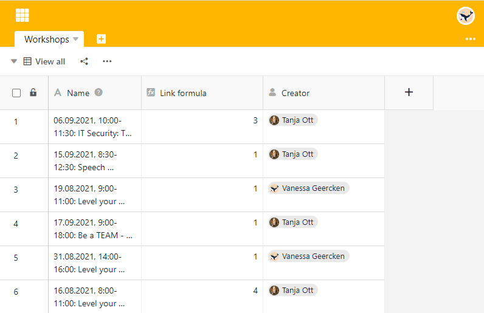

Хотите узнать, **кто** добавил строку? Тогда создайте столбец типа [Создатель](). Здесь **имя пользователя**, создавшего столбец, неизменно.

## Создайте колонку создателя

1. Добавьте **новый столбец** с помощью символа плюс в заголовке таблицы.
2. Дайте колонке **имя**.
3. Выберите тип столбца **Создатель**.
4. Нажмите **Отправить**.

## Показывайте больше подробностей о рядах через столбцы

Кроме того, вы можете использовать другие типы столбцов, чтобы отобразить, _когда_ была **создана** и **последний раз редактировалась** строка и _кто_ ее изменил в качестве **последнего редактора**.



Помимо типа столбца **Создатель**, содержимое столбцов **Создано**, [Последний редактор и Последнее редактирование]() также неизменяемо.


