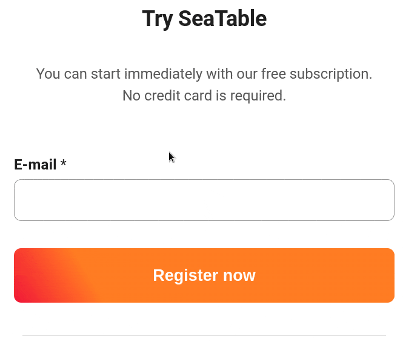

¿No ha recibido un correo electrónico de confirmación de su inscripción en SeaTable? No se preocupe. Siga los pasos que se indican a continuación y en breve podrá continuar con su registro.

## Registro con éxito

Si **no** ha recibido ningún mensaje de error durante el proceso de registro, normalmente se le habrá enviado un correo electrónico de confirmación a la dirección de correo electrónico que nos haya facilitado.

## Posibles soluciones

Si **no** ha recibido **un** correo electrónico, compruebe las siguientes opciones:

1. Tenga paciencia: en raras ocasiones, el envío del correo electrónico de confirmación puede **demorarse** un poco.
2. Comprueba tu **carpeta de spam**, la pestaña de **publicidad** si es necesario, y la **papelera**. Puede que el correo haya ido a parar allí.
3. Si **ninguno** de estos pasos ha tenido éxito, puede registrarse de nuevo [aquí]() con su dirección de correo electrónico y recibirá entonces un **nuevo** correo electrónico de confirmación.
